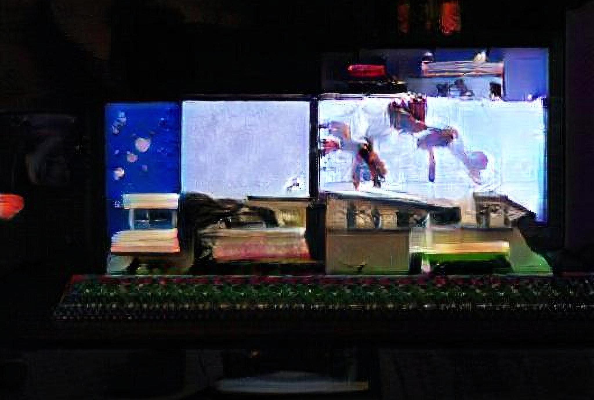

# What Machines Can't Learn

On these pages you will find the syllabus and related material for my course _What Machines Can't Learn_, which took place at the Humboldt University in Berlin during the winter semester of 2019/20. 
The course is directed at students from all kinds of disciplines who are interested in Artificial Intelligence, its limits, its societal impact and its technical underpinning. The title is borrowed from Hubert Dreyfus' 1972 book _What Computers Can't Do_.

The aim of the course is to equip students with the knowledge to understand the capabilities of current machine learning approaches, to critically evaluate claims about their promises, and to recognise the wider influence artificial intelligence has in culture and society. 

:point_right: **Go directly to** [sessions](sessions/README.md)

_Image created by author with [RunwayML](http://www.runwayml.com) using the [BigGAN](https://github.com/agermanidis/biggan) model and upscaled using [ESRGAN](https://github.com/xinntao/ESRGAN)_

## What you will find here

I provided, for each session: 
- slides and lecture notes
- references to the reading material and, where possible, links to the material itself
- links to practical exercises
- Jupyter Notebooks of the hands-on exercises, where applicable

Due to how rapid the field of AI develops, much of this material may be outdated by the time you read this. Contributions of new relevant material and exercises are therefore very much welcome!

> **Hint** The lecture slides use the [RemarkJS](https://remarkjs.com/) format. You can view them, for example,through [Remarkise](https://remarkjs.com/remarkise). Press _p_ on your keyboard to acccess presenter mode.

## About the Course

The seminar takes on a historical, applied and critical perspective towards data and computation. It looks at the history of artificial intelligence and the origins of and transition towards what is currently called machine learning. Approaches of data processing and artificial intelligence will be explored through practical exercises and hands-on projects. 

The historical and practical perspective will form the basis for a critical interrogation of the impact and promises of the current digital turn. This includes issues such as the (mis-)use of data for political gain, or the inherent bias against minorities in prevalent machine learning applications.

### Target group

No prior experience in coding or any other technical skills beyond basic usage of a computer are required. The interdisciplinary seminar is aimed at students from humanities disciplines who want to extend their critical thinking around data and the digital with applied knowledge, or vice versa, students from technical domains who seek to extend their digital skills with critical thinking about their field of knowledge and practice.

### Seminar Structure
The course is structured into eight sessions tackling the following six topics:
1. [Computers and Computing](./sessions/1_computers_and_computing/session_1_computers_and_computing.md)
2. Data
3. Artificial Intelligence
4. Machine Learning
5. Machine Creativity
6. AI Ethics

Each session is formed of three components:

- A **lecture** that introduces the topic and its history
- A **reading assignment** that provides current context and a critical perspective, followed by a **discussion**
- A **hands-on exercise** that lets students experience and experiment with the discussed technologies

The **lectures** occasionally also contain practical experiments that the students are invited to try on their own computers, or small exercises that are done with the entire group.

Depending on the size and composition of the group, it may be beneficial to to do the **hands-on exercises** in pairs, letting students try out the experiments together and discuss any problems that they might encounter. When pairing up students I found it beneficial for their learning outcome when students with similar technical skills are working together.

The **reading assignments** can be distributed at the beginning of the course. Depending on the possible seminar structure, they may be assigned as student presentations, with one or more students preparing (one of) the session reading and introducing it to the class. I had the students reading short articles or excerpts in class in order to limit their workload. However, I would probably opt for having them prepared and presented by students the next time to increase their participation in the course and allow for a deeper engagement with the reading material.

### Grading and Outcomes

Depending on the course requirements, different outcomes may be expected from students:
- a research paper on the topic
- a seminar presentation on one of the reading assignemts
- an individual project that builds on one of the hands-on exercises
When I taught the course I let students work on individual projects and allocated time during the seminar to work on them (Sessions 6 and 7). Students presented their projects during the final session.

