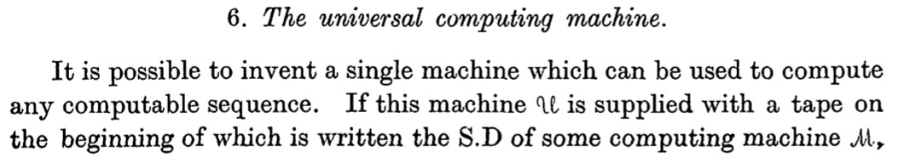
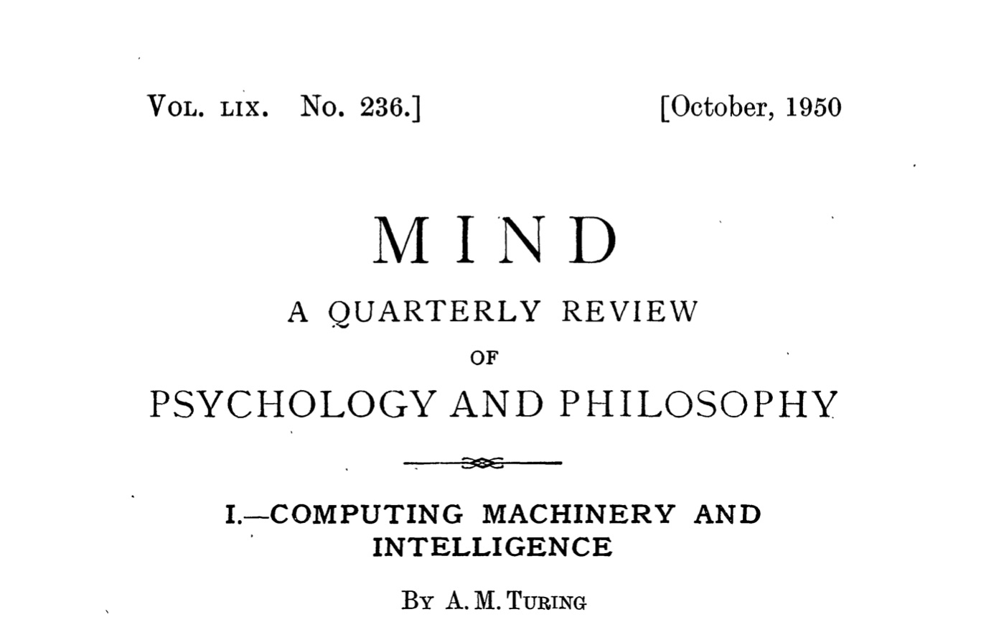
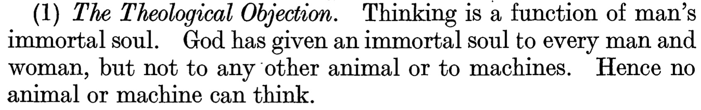
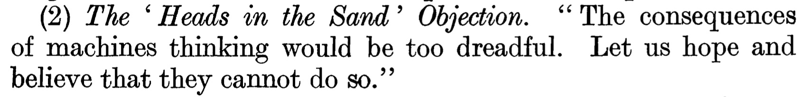
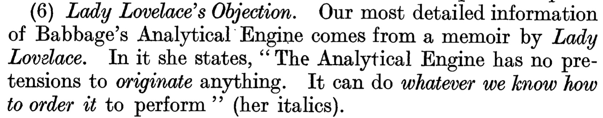

[Home](../../../README.md) / [Sessions](../../README.md) / [Session 1: Computers and Computing](../README.md) / Slides

# Session 1

## Computers & Computing

---

## What we will answer

- What is a computer?
- What is an algorithm?

---

## What is a computer?

---

### Antikythera Mechanism

_Image from [Wikimedia](https://en.wikipedia.org/wiki/Antikythera_mechanism#/media/File:NAMA_Machine_d'Anticyth%C3%A8re_1.jpg), CC BY_

???

- Antikythera mechanism
- regarded as one of the earliest computers
- device believed to be used to calculate the movements of the planets
	"The device could predict astronomical positions, eclipses, the motions of the sun, the moon and probably some of the planets." (Wikipedia)

---

### Difference Engine

_Image by [Canticle](https://en.wikipedia.org/wiki/User:Canticle), CC BY-SA_

???

- In 1822 the English mathematician Charles Babbage proposed a steam driven calculating machine the size of a room, which he called the Difference Engine.
- This machine would be able to compute tables of numbers, such as logarithm tables.

---

### Difference Engine

#### Ada Lovelace

_Image by [Antoine Claudet](https://en.wikipedia.org/wiki/en:Antoine_Claudet), CC BY-SA_

???

- recognised potential of machine as multi-purpose calculation tool
- wrote first programme for machine (although machine was never built during her lifetime)
- first computer programmer

---

### Difference Engine

#### Ada Lovelace's programme

_public domain_

---

### Colossus

_public domain_

???

- Colossus, used to break Enigma code (WW II)
- data fed on paper tape

---

### Women Computers

_Image: ZME Science via Computer History Museum_

???

- However most computers around the time not machines, but human, and mostly women
- [France, wig makers rendered job-less by fall of aristocracy](https://www.theatlantic.com/technology/archive/2013/10/computing-power-used-to-be-measured-in-kilo-girls/280633/)

---

### Eniac

_public domain_

???

- Eniac (1945) first programmable general purpose computer, vacuum tubes
- programming = patching cables

---

### Mainframe Computing

_Image by [ArnoldReinhold](https://commons.wikimedia.org/wiki/User:ArnoldReinhold), CC BY-SA_

???
- 1960s mainframe computing (one central computer, terminals)
- e.g. IBM 360

---

### Personal Computer

_Image by [Sailko](https://commons.wikimedia.org/wiki/User:Sailko), CC BY_

???
- personal computer
- here Macintosh 1984

---

### A Universal Machine

???
- transition to programmable computer = universal machines
- what we now regard as a computer, a universal machine. something that can compute different things

---

### A Universal Machine

Turing, A. M. (1937). On computable numbers, with an application to the Entscheidungsproblem. _Proceedings of the London mathematical society_, 2(1), 230-265. Available at https://www.cs.virginia.edu/~robins/Turing_Paper_1936.pdf

---

### The Turing Machine

_Image from Wikimedia Commons, CC BY-SA_

???

- the Turing Machine
- not really described as something that should be built, but as a conceptual device to proof what kind of things can be calculated and what kind of things cannot

---

### The Entscheidungsproblem

 Is there an algorithm that will take a formal language, and a logical statement in that language, and that will output "True" or "False", depending on the truth value of the statement? The algorithm does not tell how it reaches the answer, nor prove it, as long as the answer is always correct. [Wikipedia](https://simple.wikipedia.org/wiki/Entscheidungsproblem)

 ---

 #### Turing's Answer to the Entscheidungsproblem
 # No

 ---

 ### Turing Machine vs Computers

_Image from Wikimedia Commons, CC BY-SA_

_public domain_

???

- the striking difference to Turing's conceptual computer to the mechanical computers available at the time is that the data on which the computer computes and the instructions the computer follows (i.e. the programme) are stored together and can both be changed (by operators as well as by a computer)
- during that time 'programming' a computer meant physically reconnecting tubes

---

### Universal Machines

???

- this is what makes the computer 'universal'
- a reason why we now put computers in everything
- no need to design specific mechanisms, for example the programme dial on a washing machine

---

### Von Neumann architecture

???

- current computers implement the 'von Neumann' architecture, named after its inventor John von Neumann
- but idea has been more widely around, as we see in Turings paper

--

- processing unit
- control unit
- memory
- external mass storage
- input and output mechanisms

???

- A processing unit that contains an arithmetic logic unit and processor registers
- A control unit that contains an instruction register and program counter
- Memory that stores data and instructions
- External mass storage
- Input and output mechanisms

---

### Alternatives

???

---

- von Neumann architecture still the design by which most modern computers operate
- at that time just one of many proposed designs
	- including devices that operate on randomness and probabilities
	- or devices modelled after organic processes (celular automata)

---

### Turing Completeness

The von Neumann architecture, i.e. the computers we have today are "Turing complete"
- can be implemented on a Turing machine
- possess the capabilities of a Turing machine
- **possess the limits of a Turing machine**
	
???

- i.e. they can be implemented on a Turing Machine, they possess the capabilities of a Turing machine
- but crucially, they possess the limits of a Turing machine

---

### Limits of Universal Machines

A computer, as we understand, is a 'universal' machine

It is however not a machine that can do everything

The Turing machine was designed to show the limits of computability

???

- a computer, as we understand it now, is a 'universal' machine, in the sense that it is a machine that can do many things
- it is however, and crucially, not a machine that can do everything
- the very design of the computer was used by Turing to proof the limits of computability, i.e. the limits of what a computer can do

---

### What are things that computers can't do?

???

ask class

---

### Computing Machinery and Intelligence

Turing, A. M. (1950). Computing Machinery and Intelligence. _Mind_. Vol. 59, No. 236, pp. 433-460. Available at: http://www.jstor.org/stable/2251299

???

- Turing was interested in whether computers can think
- Turing argued on a mathematical basis in this paper, but also on other reasons
- for example from a religious perspective: thinking is only something granted by god to humans

---

### (Some of) Turing's objections to machine intelligence

---

### (Some of) Turing's objections to machine intelligence

---

### (Some of) Turing's objections to machine intelligence

---

### What is a computer?

--

#### A universal machine that can do computations

---

### What sort of computations?

--

#### Algorithms
(for example)

---

## What is an algorithm

???

- (ask class)
- different philosophies, ideas, no correct answer

---

## What is an algorithm

_Image by M. Tomczak, CC BY-SA_

???

- name derived from Muhammad ibn Musa al-Khwarizmi
- Wikipedia: Al-Khwarizmi's popularizing treatise on algebra (The Compendious Book on Calculation by Completion and Balancing, c. 813–833 CE[8]:171) presented the first systematic solution of linear and quadratic equations.

---

## What is an algorithm

### A set of steps to accomplish a certain task

---

## What is an algorithm

_public domain_

???

- Wikipedia: "[Lovelace] describes an algorithm for the Analytical Engine to compute Bernoulli numbers. It is considered to be the first published algorithm ever specifically tailored for implementation on a computer, and Ada Lovelace has often been cited as the first computer programmer for this reason.The engine was never completed so her program was never tested."

---

## What is an algorithm

### A set of steps that is guaranteed to accomplish a certain task

---

### Prerequisites of an algorithm

- it is guaranteed to terminate
- each step can be executed independently
- each step does not require insights or background knowledge

???

- prerequisites for something to be an algorithm
- it is guaranteed to terminate, i.e. complete the specific task
	- so e.g. an operating system is not an algorithm, because it just runs and runs until we switch it off
- each step can be executed independently
	- it does not need to be aware of the steps that came before or the steps that follow
- each step does not require insights or background knowledge
	- i.e. does not require thinking, improvisation, does not require to make assumptions

---

## Guess the number

???

- exercise
	- I think of a number between 1 and 100, you need to guess which one
	- after each guess I will tell you whether my number is higher or lower than that
	- (my number is 68)

---
 # 68

 ???

- Questions: 
- what strategy have you used?
- what other strategies would be possible?
- what about more complex problems?
	- what are some of the things you use your phone for? (navigation, information seeking, messaging)
	- what steps are involved?
