[Home](../../../README.md) / [Sessions](../../README.md) / [Session 2: Data](../README.md) / Slides

# Session 2

## Data

---

## Exercise: 0

Request your data from Facebook

---

---

---

## What is data?

---

## What is data?

Latin: dare, datum - the given

???

Etymological origin of the word
But also how it is still often treated

---

## What is data?

data vs ‘capta’:

> Capta is “taken” actively while data is assumed to be a “given” able to be recorded and observed.

Drucker, J. (2011). Humanities Approaches to Graphical Display. 5(1). Retrieved from http://www.digitalhumanities.org/dhq/vol/5/1/000091/000091.html

???

In (digital) humanities discourse, data = capta (the taken). Advocated by Johanna Drucker. Data is always taken, measured, fit into a model, etc. 

---

### Data Visualisation

image: Dr. John Snow’s chart tracing the source of an epidemic using graphical methods that plotted frequency of outbreaks and geographical location. 

see also: Latour, B. (1986). Visualisation and Cognition: Drawing Things Together. Knowledge and Society Studies in the Sociology of Culture Past and Present, 6, 1–40.

???

Relationship between data and visualisation, as a tool to make sense.

Latour emphasises the role of image and image making to analyse data, and how people made a of the latest visualisation technology to understand data.

John Snow’s famous example of plotting cholera outbreaks on map, observing that they center around water pumps (and concluding that the water spreads the disease)

---

### DIKW Pyramd

image by [Longlivehteux](https://commons.wikimedia.org/w/index.php?title=User:Longlivetheux), CC BY-SA

???

Credited to various people
Often employed and useful to illustrate that data needs to be tramsformed into something useful

But also perpetuates idea of ‘raw’ data, (data as the new oil)

Besides, what is wisdom?

---

### Who is included in data? 

> “Our maternal data is embarrassing,” […] “What we choose to measure is a statement of what we value in health,” he explains. We might edit his statement to add: it’s a measure of who we value in health, too. 

D’Ignazio, C., & Klein, L. (2019). Bring Back the Bodies. In Data Feminism. Retrieved from https://bookbook.pubpub.org/pub/zrlj0jqb

???

- Data is only what we capture and what we choose to capture
What we capture defines what we think is important

- Quote discussing lack of data on women’s deaths of during child births

- From forthcoming book by D’Ignazio on Klein, draft available

---

### What is included in data?

image: screenshot of Onuoha, M. 2018. Missing Datasets. Available at https://github.com/MimiOnuoha/missing-datasets

???

List by artist Mimi Onuoha of data that should be available but is not being collected

---

### Big Data

image by [Simon Waldherr](https://commons.wikimedia.org/wiki/User:SimonWaldherr), CC BY-SA

???

- what does term mean?
    - too big to store in memory
    - Too fast to process (e.g. data produced by CERN Large Hadron Collider)

---

### Personal Data

- “data new oil” phrase often refers to personal data used for advertising
    - i.e. personal data that is stored on other people’s computers
    - data in the cloud, makes it no more personal

---

### Reclaiming Personal Data

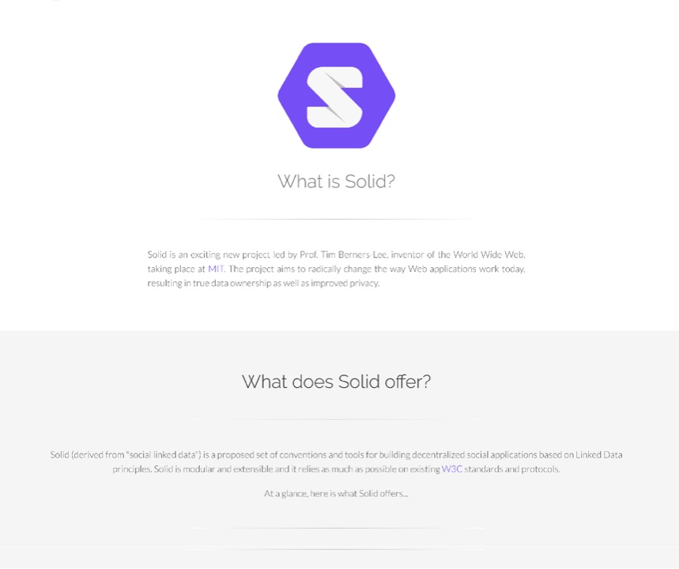
image: Screenshot of https://solid.mit.edu/

???

- efforts to recentralise web
- store personal data in personal storage, allow platforms access (Solid)
- can also be interesting for platforms that don’t make money with your data
    - i.e. small online shops, web services need to store some personal data (name, email, address) but cannot bear the responsibility for it (GDPR) in cases of data breach

---

## History of Data

---

### Ishango bones

image: Royal Belgian Institute of Natural Sciences, from https://www.bbc.com/news/business-39870485

????

“The 20,000-year-old Ishango Bone - found near one of the sources of the Nile in the Democratic Republic of Congo - seems to use matched tally marks on the thigh bone of a baboon for correspondence counting.”
used for counting, but counting of what?" - https://www.bbc.com/news/business-39870485

---

### Cuneiform tablets

image from http://www.disci.unibo.it/it/eventi/archaic-textes-and-early-state-economies-in-mesopotamia#--

???

- 5000 years old
- counting different objects, 
- recording trade and 

---

### Punch cards

80 columns punch card (IBM standard). Image by [Harke](https://commons.wikimedia.org/wiki/User:Harke), CC BY-SA

???

- Early(est) electronic example of data: punch card
- punch card have been around since early 18th century to control weaving looms in France
- although inventor of electronic punch cards Hollerith insisted that the inspiration was the Pullman railroad ticket, i.e. something distinctly American (von Oertzen 2017, Machineries of Data Power)

### Punch cards - records of data

> We strictly discriminate between list and table. The first one always refers to one specimen, to one particular individual. In the latter, the specimen or individual is no longer visible; the table contains already a condensed result, a summary and a grouping of information from the lists

Ernst Engel, 1861, quoted in: von Oertzen, C. (2017). Machineries of Data Power: Manual versus Mechanical Census Compilation in Nineteenth-Century Europe. Osiris, 32, 129–159.

???

- However, crucial was a re-thinking that happened earlier (as argued by von Oertzen)
- understanding the difference between a single piece of data (a record), and what is derived from the data
- made it possible to handle individual pieces of data at different places
allowed Prussian state to handle their “big data” problem of census data

---

### Big data processing

> the Prussian census bureau entrusted the bulk of compilation work to the wives and other female relatives of its male officials. Having these women do the state’s paper work in their homes was cost-effective…

von Oertzen, C. (2017). Machineries of Data Power: Manual versus Mechanical Census Compilation in Nineteenth-Century Europe. Osiris, 32, 129–159.

???

- data could be processed at homes by women workers at low wages

---

## Data and the Web

---

### What happens when one enters a URL?

---

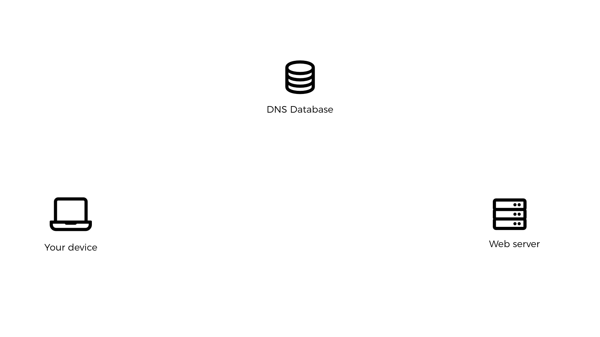

---

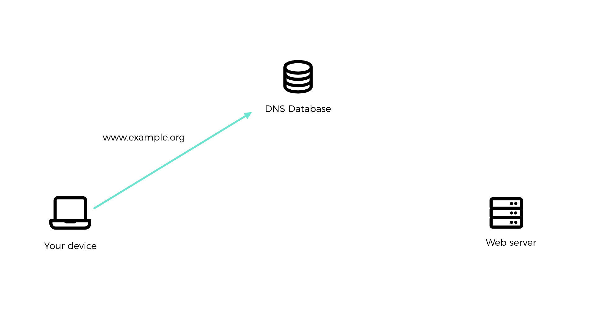

---

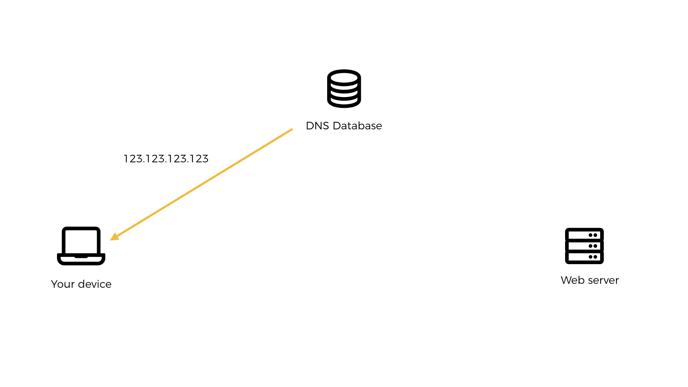

---

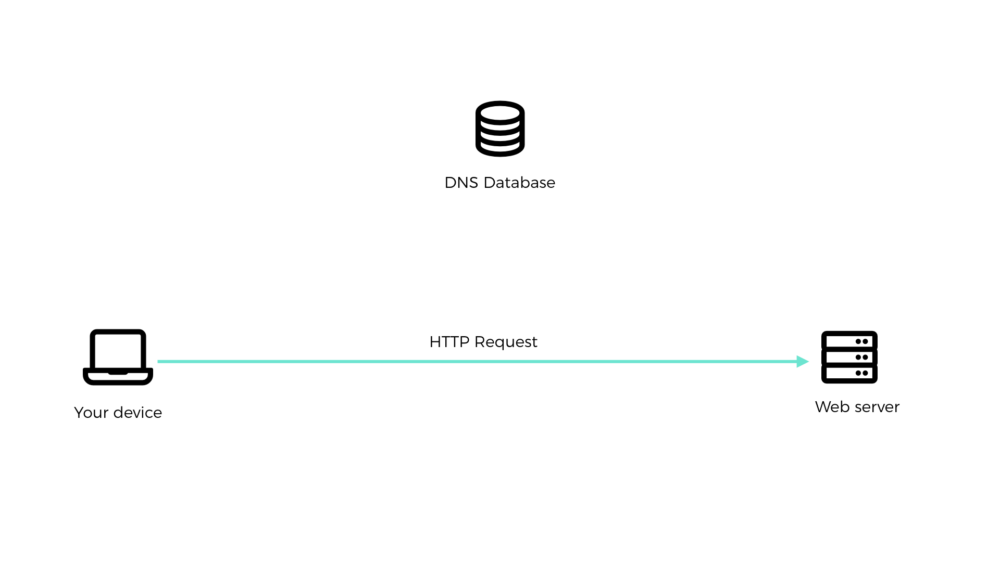

---

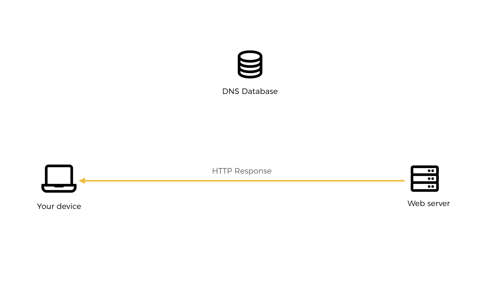

---

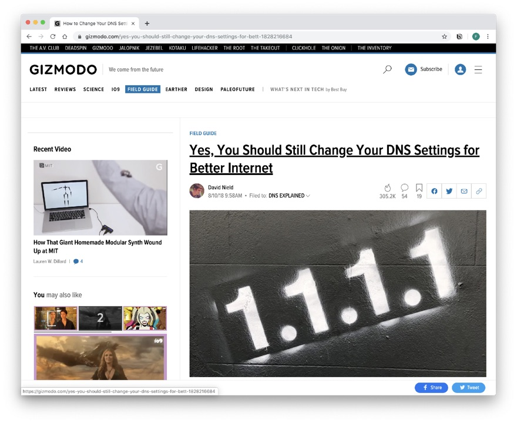

Gizmodo article recommending to use Google's DNS service, https://gizmodo.com/yes-you-should-still-change-your-dns-settings-for-bett-1828216684

???

- Every request goes through a DNS server
- Advice of changing DNS settings to Google in order to speed up connection
- Normally DNS defined by ISP (e.g. T-Mobile, O2). 
- Google offers faster lookup speed, but of course also is able to gather data with every request

---

### HTTP Request

<blockquote class="twitter-tweet" data-lang="en">
anatomy of a HTTP request <a href="https://t.co/L2k6183mf0">pic.twitter.com/L2k6183mf0</a>
&mdash; 🔎Julia Evans🔍 (@b0rk) <a href="https://twitter.com/b0rk/status/1145362860136177664?ref_src=twsrc%5Etfw">June 30, 2019</a></blockquote>

Evans, J. (2019). HTTP: Learn your browser’s language. Retrieved from https://gumroad.com/l/http-zine

---

### HTTP Response

<blockquote class="twitter-tweet" data-lang="en">
anatomy of a HTTP response <a href="https://t.co/nX6n153TTT">pic.twitter.com/nX6n153TTT</a>
&mdash; 🔎Julia Evans🔍 (@b0rk) <a href="https://twitter.com/b0rk/status/1145896193077256197?ref_src=twsrc%5Etfw">July 2, 2019</a></blockquote>

Evans, J. (2019). HTTP: Learn your browser’s language. Retrieved from https://gumroad.com/l/http-zine

---

### Linked Open Data

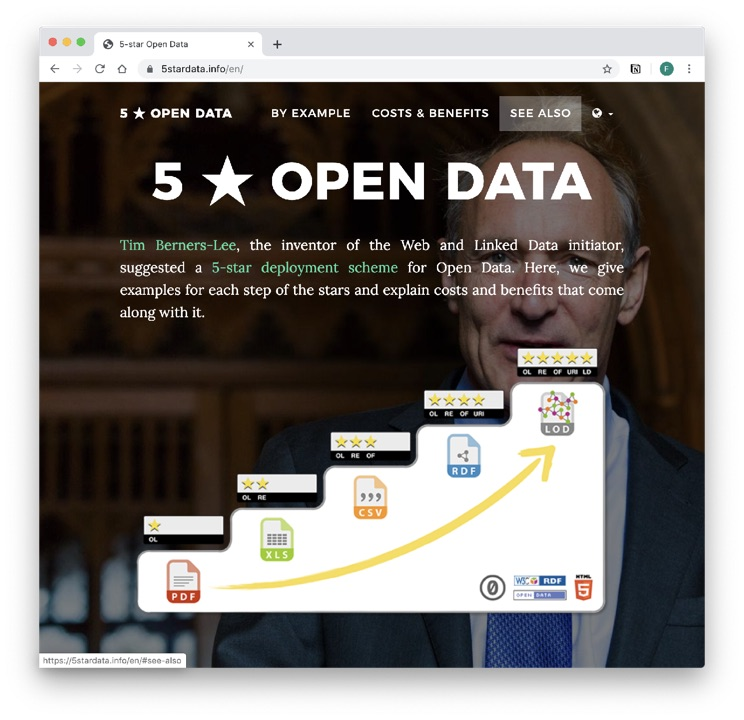

image: Screenshot of http://5stardata.info

???

- original idea of the web as a web of data
- connect not only documents but things, concepts, data points

---

### LOD Knowledge Graphs

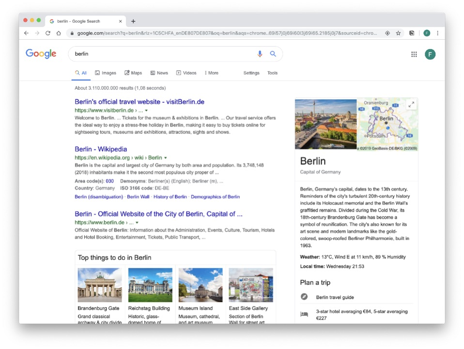

???

- increasingly employed by companies, search engines
    - e.g. data in box on the right. Taken from Wikidata
- possible to store facts in a form that is readable by a computer and - - accessible to the web
- possible to encode context (e.g. Berlin is a city, Paris is a city vs Paris is a mythological character)
- possible to generalise (Berlin is a settlement, is in Germany, etc.)

---

### Knowledge Graphs for AI

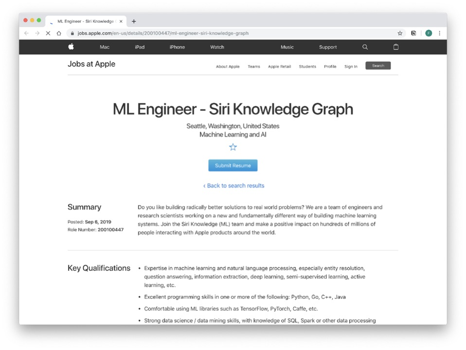

???

- Linked Data => Knowledge Graph
- original idea for web, but never really embraced, until now
- AI has need for structured datasets that encode context
    -to interpret natural language, understand context, etc.
- See also wolfram alpha

---

### Exercise 1

#### What data is produced when you visit a site?

Visit https://artificial-senses.kimalbrecht.com

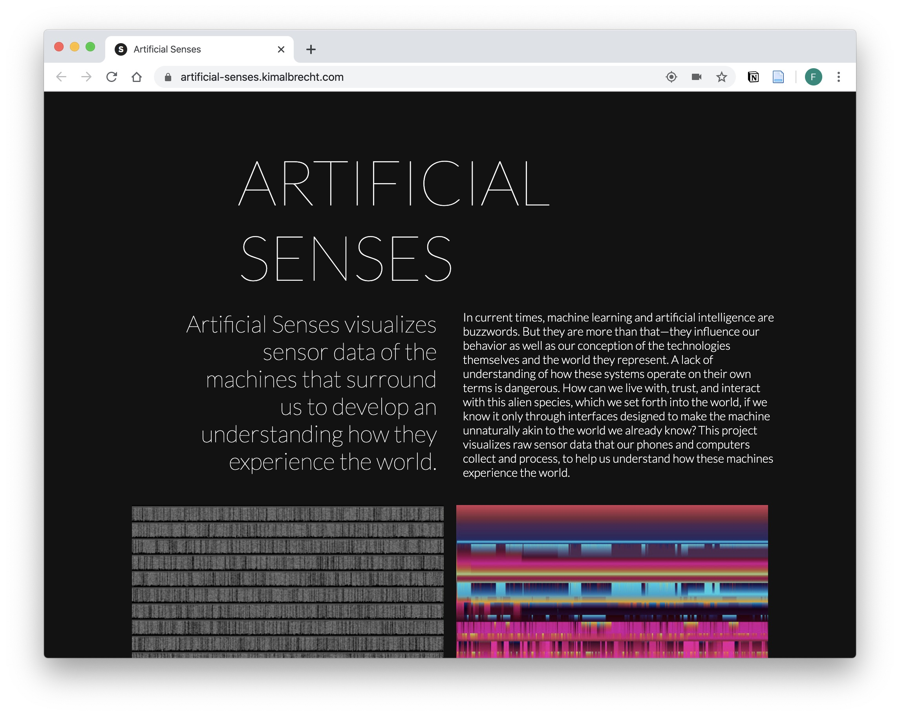
image: Screenshot of Artificial Senses by [Kim Albrecht](http://www.kimalbrecht.com), 2017

???

- Try out experiments
- Which types of data collection methods are you being made aware of (through confirmation)
- Which ones aren’t
- How may the ones who you are not made aware of being used

---

### Exercise 2

Explore application data and network traffic in Web Inspector

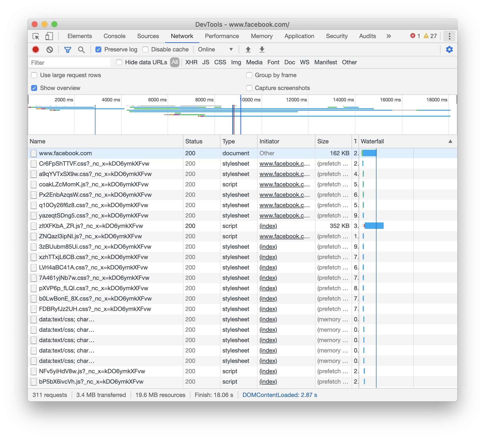

???

Activate web inspector (Apple: Command+Alt+i)
Open Humboldt Uni site
Open a social media site
Look at Application data
Traffic (e.g. when composing something, or just doing something)

---

### Exercise 3

Data manipulation using Web Inspector

???

- Fake a tweet by editing the content
- Right click and choose Inspect
- Identify and edit the text
- pro tip: 
    - open the console and enter: document.designMode = "on"
    - confirm with Return
    - website text is now editable in browser

---

## How is personal data being used

---

### Exercise 4

Download and inspect your Facebook data

???

- is this everything?
- what might be missing?
- how is this useful?
- how can it be combined to make it  more useful?

---

### Exercise 5 (optional)

Your Facebook data analysed: applymagicsauce.com

???

- result
- accurate?
- what might be the influencing factors?

---

### Exercise 6

#### How to find out what Facebook knows?

Create an ad on facebook.com/business

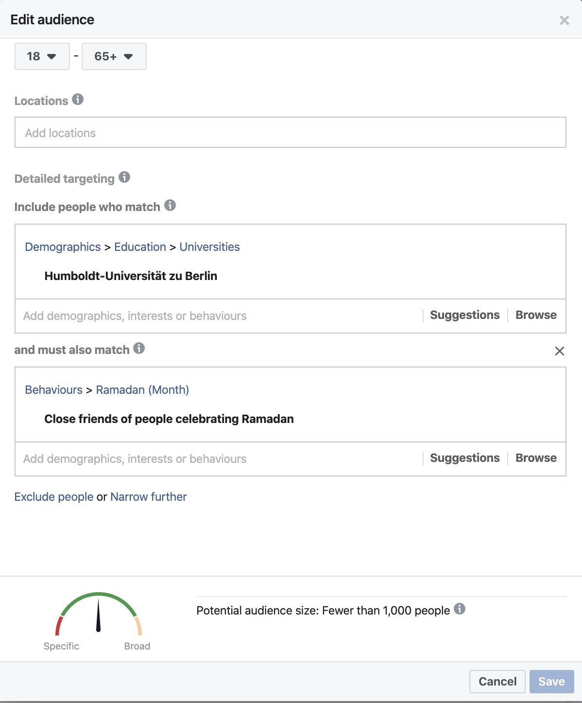

???

- Facebook does not give much insights to their users (products). But to their clients
- Try to build an audience to advertise to
    - Facebook gives feedback on demographic and available data when constructing target group
- note: provide a dummy Facebook account for students