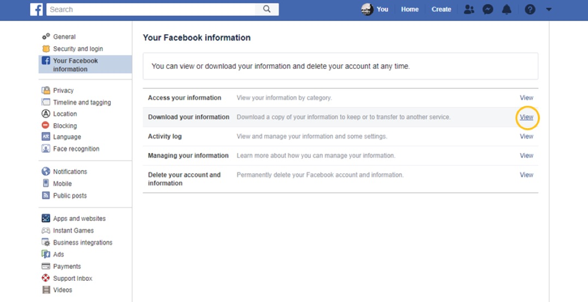
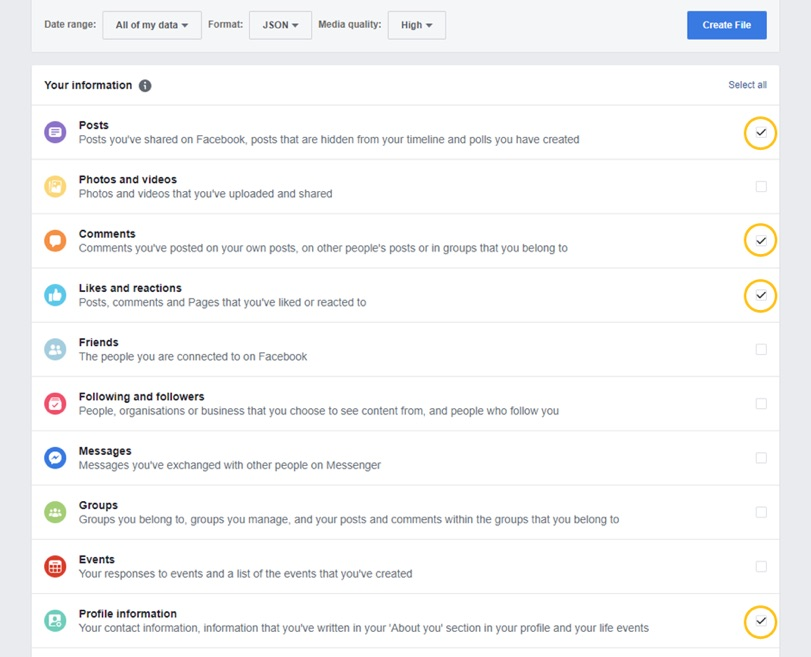
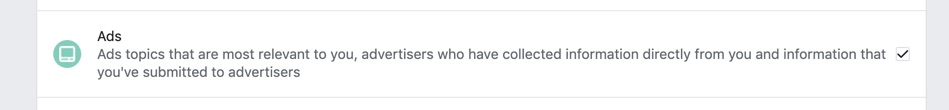
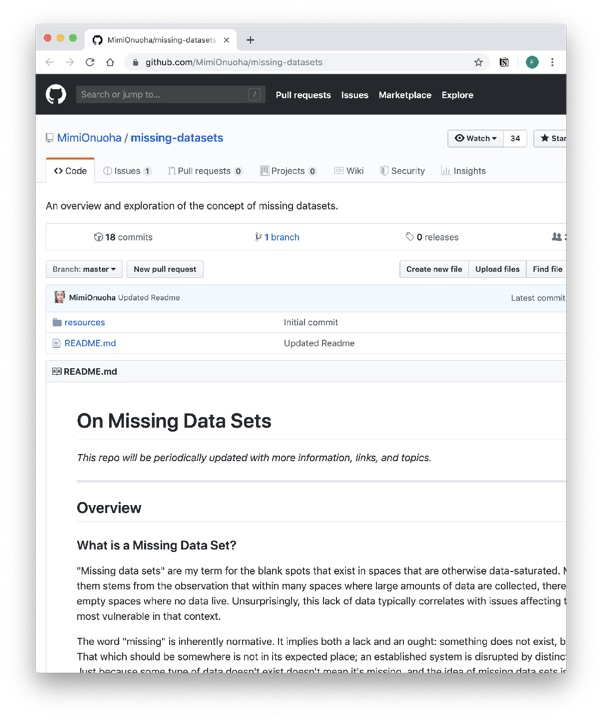

[Home](../../../README.md) / [Sessions](../../README.md) / [Session 2: Data](../README.md) / Slides

# Session 2

## Data

---

## Exercise: 0

Request your data from Facebook

---

---

---

## What is data?

---

## What is data?

Latin: dare, datum - the given

???

Etymological origin of the word
But also how it is still often treated

---

## What is data?

data vs ‘capta’:

> Capta is “taken” actively while data is assumed to be a “given” able to be recorded and observed.

Drucker, J. (2011). Humanities Approaches to Graphical Display. 5(1). Retrieved from http://www.digitalhumanities.org/dhq/vol/5/1/000091/000091.html

???

In (digital) humanities discourse, data = capta (the taken). Advocated by Johanna Drucker. Data is always taken, measured, fit into a model, etc. 

---

### Data Visualisation

image: Dr. John Snow’s chart tracing the source of an epidemic using graphical methods that plotted frequency of outbreaks and geographical location. 

see also: Latour, B. (1986). Visualisation and Cognition: Drawing Things Together. Knowledge and Society Studies in the Sociology of Culture Past and Present, 6, 1–40.

???

Relationship between data and visualisation, as a tool to make sense.

Latour emphasises the role of image and image making to analyse data, and how people made a of the latest visualisation technology to understand data.

John Snow’s famous example of plotting cholera outbreaks on map, observing that they center around water pumps (and concluding that the water spreads the disease)

---

### DIKW Pyramd

image by [Longlivehteux](https://commons.wikimedia.org/w/index.php?title=User:Longlivetheux), CC BY-SA

???

Credited to various people
Often employed and useful to illustrate that data needs to be tramsformed into something useful

But also perpetuates idea of ‘raw’ data, (data as the new oil)

Besides, what is wisdom?

---

### Who is included in data? 

> “Our maternal data is embarrassing,” […] “What we choose to measure is a statement of what we value in health,” he explains. We might edit his statement to add: it’s a measure of who we value in health, too. 

D’Ignazio, C., & Klein, L. (2019). Bring Back the Bodies. In Data Feminism. Retrieved from https://bookbook.pubpub.org/pub/zrlj0jqb

???

- Data is only what we capture and what we choose to capture
What we capture defines what we think is important

- Quote discussing lack of data on women’s deaths of during child births

- From forthcoming book by D’Ignazio on Klein, draft available

---

### What is included in data?

image: screenshot of Onuoha, M. 2018. Missing Datasets. Available at https://github.com/MimiOnuoha/missing-datasets

???

List by artist Mimi Onuoha of data that should be available but is not being collected

---