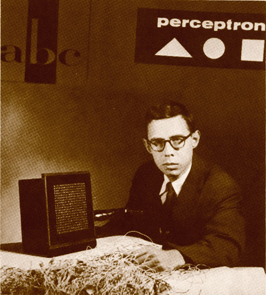

# Session 3: Artificial Intelligence

---

# A Brief History of AI

--- 

## Resources

- AI: 15 key moments in the story of artificial intelligence. BBC. Available at https://www.bbc.com/timelines/zq376fr
- Timeline: A History of Ai. Available at https://ahistoryofai.com/

---

## 1956

Dartmouth College Summer Research Project on Artificial intelligence

image: First page of Proposal for Dartmouth Summer Research Project on Artificial Intelligence. Photo courtesy of Dartmouth College. Available at https://www.aaai.org/ojs/index.php/aimagazine/article/view/1904

???

- Birth of the term “Artificial Intelligence”
- Coined by computer scientist John McCarthy at the 
- beginning of “golden years of AI” that lasted until mid 1980s
- before
----

## before

...

---

## 1936

Turing Machine

image: Sketch of a Turing machine by [Wvbailey](https://en.wikipedia.org/wiki/User:Wvbailey), available at https://en.wikipedia.org/wiki/File:Turing_machine_1.JPG. CC SA 3.0.

???

- formalisation of a “Universal Machine” to do computation

---

## 1950

Turing’s paper Computing machinery and intelligence

image: Title page of Alan Turings article on Computing Machinery and Intelligence. Available at https://archive.org/details/MIND--COMPUTING-MACHINERY-AND-INTELLIGENCE/mode/2up

???

  - http://www.turingarchive.org/browse.php/B/19
  - discusses whether artificial intelligence is possible at all
  - formalises Turing test (? describe) as a way to evaluate whether a machine exhibits intelligence (we cannot know whether it _is_ intelligence)

---

## 1943

First artificial neuron
  - Warren McCulloch and Warren Pitts develop a mathematical model of a biological neuron
  - now fundamental for dominant machine learning applications

image: Schematic sketch of a McCulloch and Pitts Artificial Neuron. Source unknown

---

## 1955

Logic Theorist (Newell, Simon & Shaw)

image: Formal description of Logic Theorist from the original memorandum available at https://history-computer.com/Library/Logic%20Theorist%20memorandum.pdf

???

  - program written by Allan Newell, Herbert A. Simon and Cliff Shaw
  - intended to simulate the process of human thought and make decisions
  - finding proofs by doing inference, early expert system
  - received mediocre response, potential was not recognised
  - https://history-computer.com/Library/Logic%20Theorist%20memorandum.pdf

---

## back to 1956

Two competing approaches in AI:
- top down vs bottom up
- symbolic AI vs connectionist AI

---

## Symbolic AI

- by now also known as GOFAI
- represent world as symbols
- describe rules for manipulating symbols

???

- idea to represent world by symbols and describe rules of how to reason with these symbols

---

## Connectionist AI

- modelled after artificial neurons (McCulloch and Pits)
- statistical models

---

## Symbolic vs Connectionist

- formalise through logic by hand vs derive from data by training

---

### Examples

## Symbolic AI

- Logic Theorist (Newell, Shaw & Simon) 1955
- General Problem Solver (Newell & Shaw) 1959
- ELIZA (1966) (https://www.masswerk.at/elizabot/)

???

Try out ELIZA
look at code

---

### Examples

## Connectionist AI

- Perceptron (Rosenblatt) 1958

<small>Rosenblatt, with the image sensor of the Mark I Perceptron (Source: Arvin Calspan Advanced Technology Center; Hecht-Nielsen, R. Neurocomputing (Reading, Mass.: Addison-Wesley, 1990).)</small>

???

http://playground.tensorflow.org/

---

### Winner: Symbolic AI

Symbolic (top-down) AI emerged as dominant theorem 
- due to a paper by Minsky & Papert, 1969, Perceptrons

---

### The problem with perceptrons

- a single layer perceptron cannot compute a XOR function
- critique only applies to single layer perceptron
- Rosenblatt showed that multi-layer perceptron can solve it
  - but he did not find an algorithm to train it

=> try: http://playground.tensorflow.org/

???

- XOR function, non linearly separable problem
- Minsky, who was a [client of child sex trafficker Jeffrey Epstein](https://twitter.com/Afflictort/status/1159925328921448448), and Seymourt Papert publish paper criticising the Perceptron
- argue that a single layer perceptron cannot compute a XOR function
- convince almost entire AI community that connectionist AI is a dead end
- training algorithm only developed much later

---

## Pinnacle and Fall of Symbolic AI

Shakey the Robot
 - https://www.nytimes.com/video/science/1247468057234/shakey.html (2:30)
 - https://www.youtube.com/watch?v=7bsEN8mwUB8

 

 Image: Shakey the Robot, image from https://history-computer.com/Dreamers/Shakey.html

???

- Pinnacle of symbolic AI
- but also made limits of symbolic AI painfully evident
  - extremely slow as it had to make a new representation of the environment after every move
  - could only operate in very limited toy environment
---

## Failure of Symbolic AI

Can you imagine why symbolic AI failed?

???

- frame problem (Dennett)
  - how to decide what is relevant?
  - how to formulate universal rules?
- symbol grounding problem
  - What is the meaning of a symbol?
  - can we understand ’tree’ without having an understanding of a tree?
    - where does the understanding come from?
    -  do we recognise a drawing of a tree if we have never seen a tree?

---

## From logic to nature

Rodney Brooks, Elephants don’t play chess, 1990

---

## Subsumption architecture

https://www.youtube.com/watch?v=9u0CIQ8P_qk?t=60

???

- Subsumption architecture 
- Brooks, Intelligence without representation, 1991
  - http://gki.informatik.uni-freiburg.de/teaching/ws0809/map/mas_lect3.pdf_
- robots built from stacked layers with distinct purpose

---

## Subsumption architecture

- Situatedness and embodiment
  - ’real’ intelligence in the real world
- Intelligence and emergence
  - ‘intelligence’ as something complex which arises from simple interaction with the world

---

## 1986

finally: Backpropagation algorithm
- Rumelhart, Hinton & Williams described an algorithm for training neural networks

???

- will look at it next session on Machine Learning
---