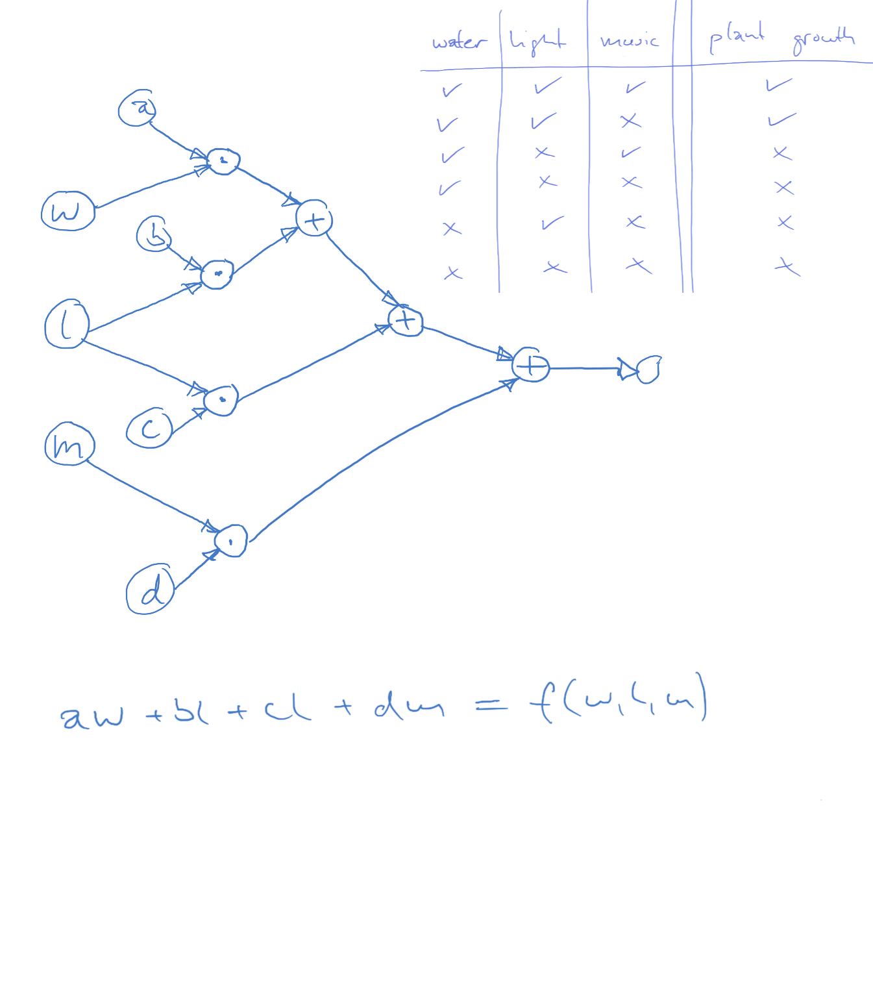

[Home](../../../README.md) / [Sessions](../../README.md) / [Session 4: Machine Learning](../README.md) / [Introduction to Neural Networks](notes_introduction_to_neural_networks.md) / Computational Graph Exercise

# Session 4: Machine Learning

* [Introduction](notes_0_introduction_to_neural_networks.md)
* [Linear Functions](notes_1_linear_functions.md)
* [Modelling Data with Linear Functions](notes_2_modelling_data_with_linear_functions.md)
* [Representing Functions as Computational Graphs](notes_3_functions_as_computational_graphs.md)
* [Training a Computational Graph on Data](notes_4_training_a_computational_graph.md)
* Computational Graph Exercise
* [Neural Networks](notes_5_neural_networks.md)

## Computational Graph Exercise

In the [previous step](notes_4_training_a_computational_graph.md) we sketched the computational graph below to predict plant growth based on the given training data. We initialised the weights and calculated some examples. The next step would be to update the weights and calculate the examples again.

This is cumbersome to do manually so instead, you can use this toy example that implements the graph we sketched:

https://codepen.io/fkraeutli/project/full/ZeWeNN

You can update the weights using the sliders and see how well the graph performs on the given data.

1) play around with the weights and see how the predictions update
2) can you get to a 100% correct prediction?
3) can you find other configurations that work?

If you know a thing or two about plant growth, you can probably guess which weights need to be enhanced. The point of this exercise is however also to note that there are countless configurations that also give correct results.

Note: the source code of the exercise can be found at https://github.com/fkraeutli/computational-graph-exercise

Next: [Neural Networks](notes_5_neural_networks.md)