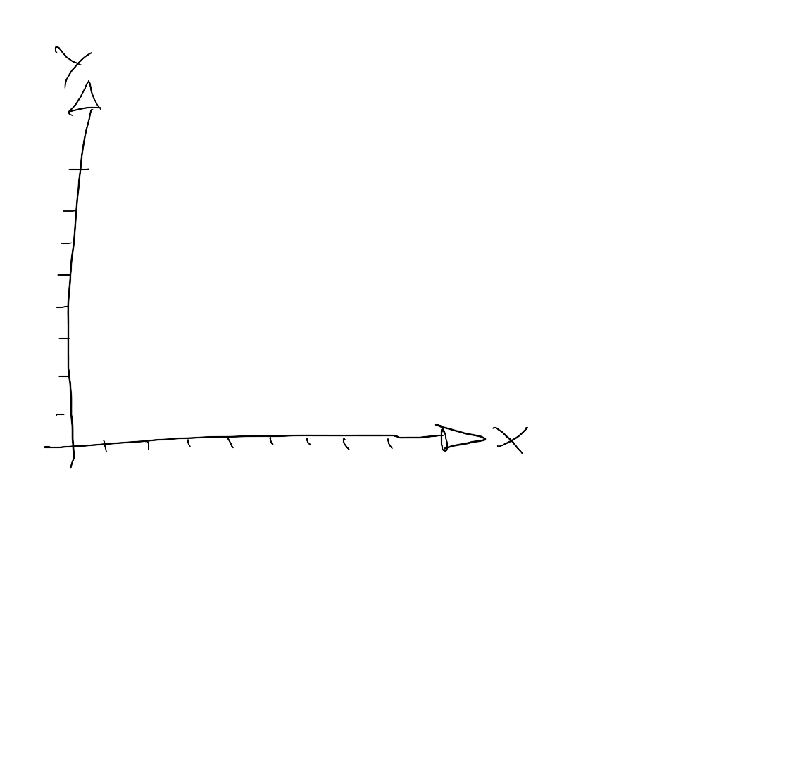

[Home](../../../README.md) / [Sessions](../../README.md) / [Session 4: Machine Learning](../README.md) / [Introduction to Neural Networks](notes_0_introduction_to_neural_networks.md) / Linear Functions

# Session 4: Machine Learning

* [Introduction](notes_0_introduction_to_neural_networks.md)
* Linear Functions
* [Modelling Data with Linear Functions](notes_2_modelling_data_with_linear_functions.md)
* [Representing Functions as Computational Graphs](notes_3_functions_as_computational_graphs.md)
* [Training a Computational Graph on Data](notes_4_training_a_computational_graph.md)
* [Computational Graph Exercise](exercise_1_computational_graph.md)
* [Neural Networks](notes_5_neural_networks.md)

## Linear Functions

A linear function can be plotted as a straight line with respect to a X and Y axis

Linear functions have the form `y = ax + b`. `a` as a multiplier of `x` determines how steep the line is. `b` adds a vertical offset. We use `y` and `f(x)` interchangeably here.

Let's fill in some numbers. For example `2` for `a` and `1` for `b`. We can calculate the values for `f(x)` for arbitrary values of `x`

Plotting examples of `f(x)` as dots...

...and drawing a line through them gives us a plot of the linear function.

Next: [Modelling Data with Linear Functions](notes_2_modelling_data_with_linear_functions.md)