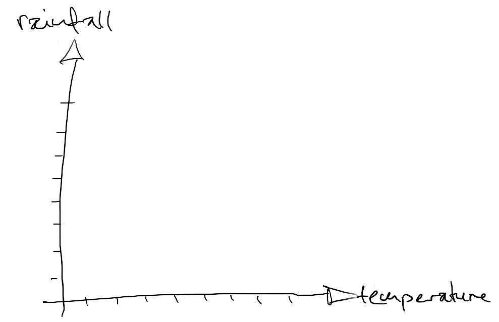
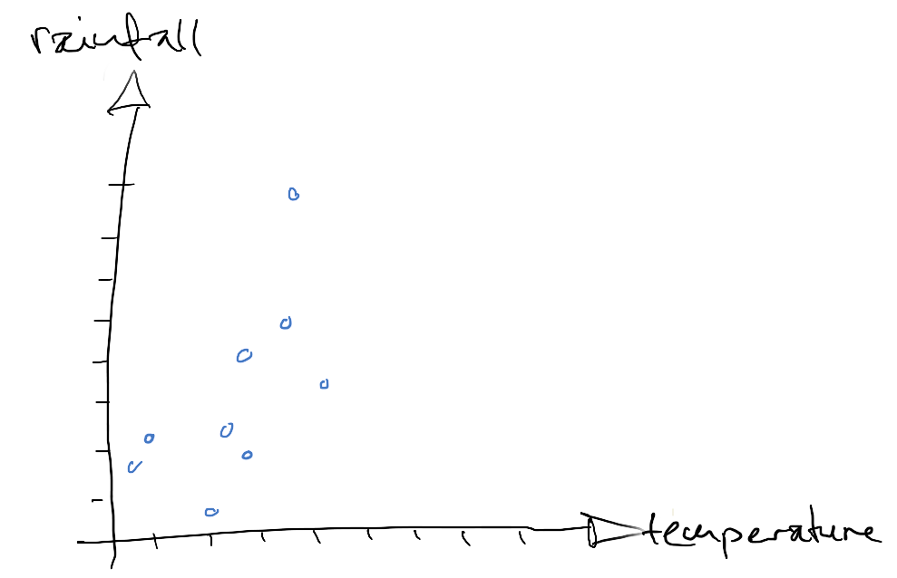
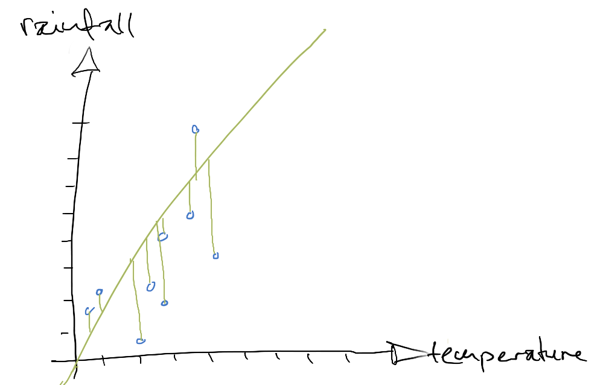
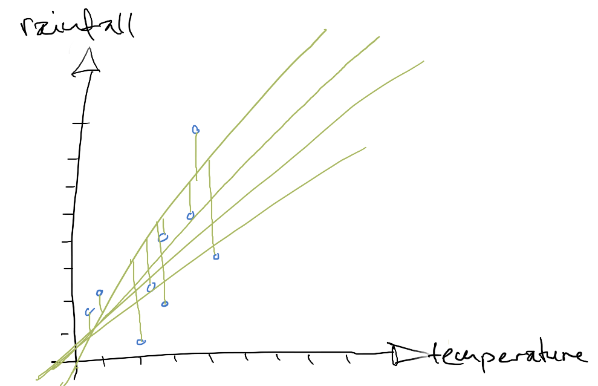
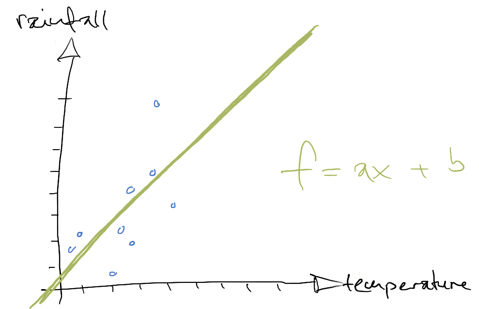
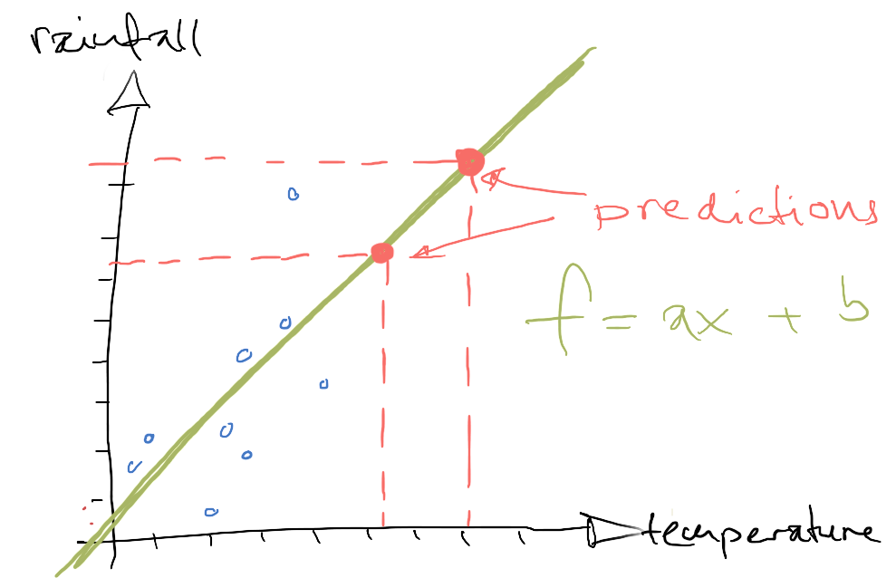

[Home](../../../README.md) / [Sessions](../../README.md) / [Session 4: Machine Learning](../README.md) / [Introduction to Neural Networks](notes_introduction_to_neural_networks.md) / Modelling Data with Linear Functions

# Session 4: Machine Learning

* [Introduction](notes_0_introduction_to_neural_networks.md)
* [Linear Functions](notes_1_linear_functions.md)
* Modelling Data with Linear Functions
* [Representing Functions as Computational Graphs](notes_3_functions_as_computational_graphs.md)
* [Training a Computational Graph on Data](notes_4_training_a_computational_graph.md)
* [Neural Networks](notes_5_neural_networks.md)

## Modelling Data with Linear Functions

Let's plot some 'actual' data. For example, let's assume we have measurements of temperature and rainfall.

Each measurement has two dimensions, amount of rainfall and temperature. We can visualise these measurements in a two-dimensional plot.

Our hypothesis is that the amount of rainfall is dependent on the temperature and that we can model this relationship through a linear function.

We don't know the function, but we can approximate it through [Linear Regression](https://en.wikipedia.org/wiki/Linear_regression). We start with an arbitrary linear function and evaluate how closely this function represents the data by looking at how far each data point is from the line. We take the square of each error. This way we compensate for errors in different directions by making them all positive and we punish data points the further they are away from the line. 

How well our linear function models the represented data is evaluated through the mean square error of all the data points. We adjust the two parameters of the linear function until we reach one where the mean square error is sufficiently low.

This linear function _models_ our data. It does not represent it exactly, but is an approximation, a simplification of our data.

Crucially, we can also use this function to _predict_ new data points. We can get an idea how levels of rainfall might increase with increasing temperatures.

Next: [Representing Functions as Computational Graphs](notes_3_functions_as_computational_graphs.md)