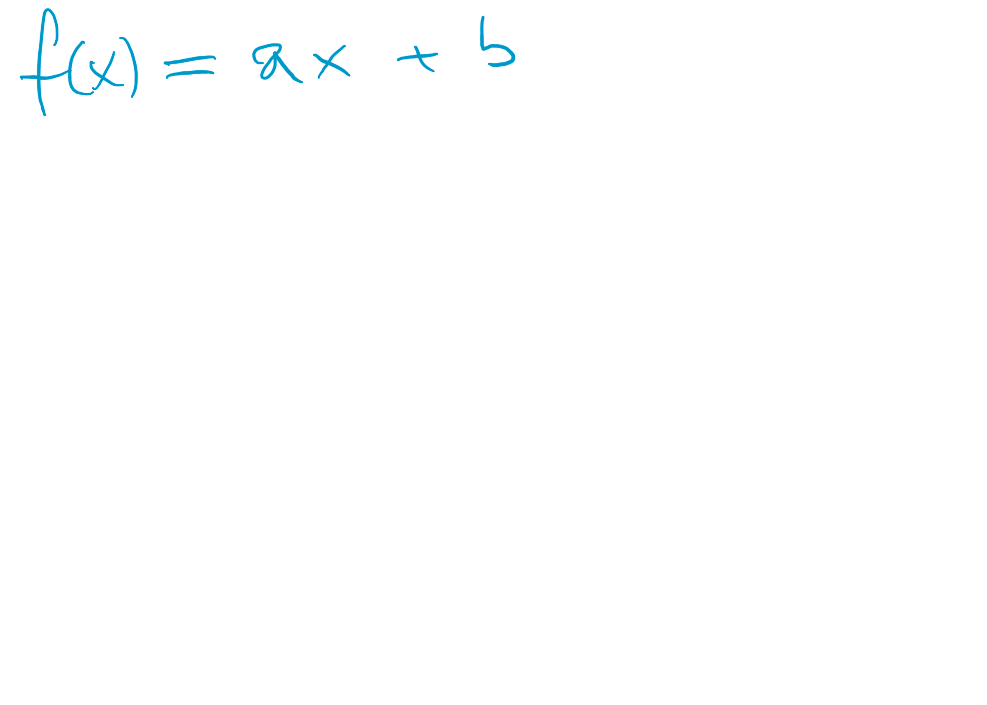
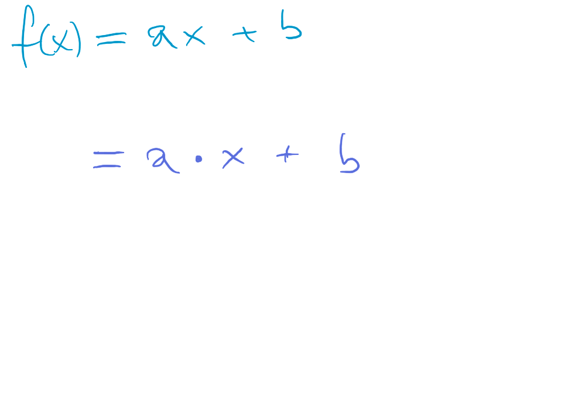
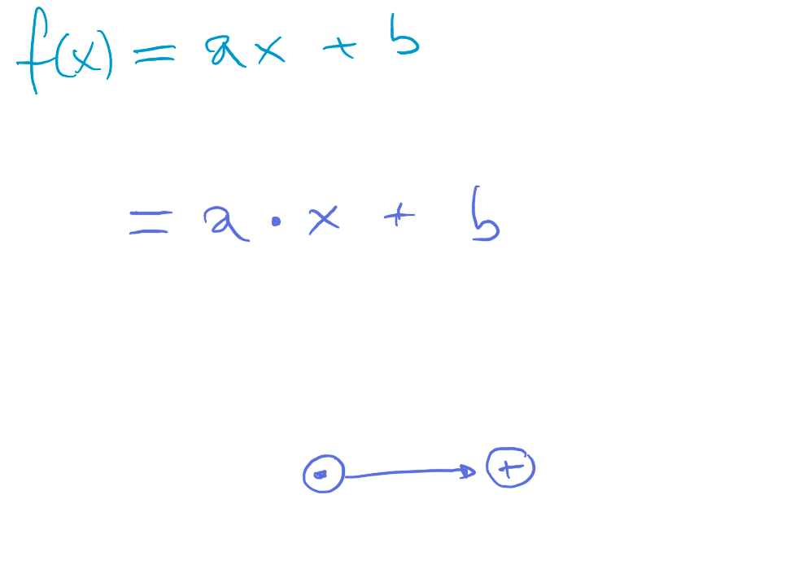
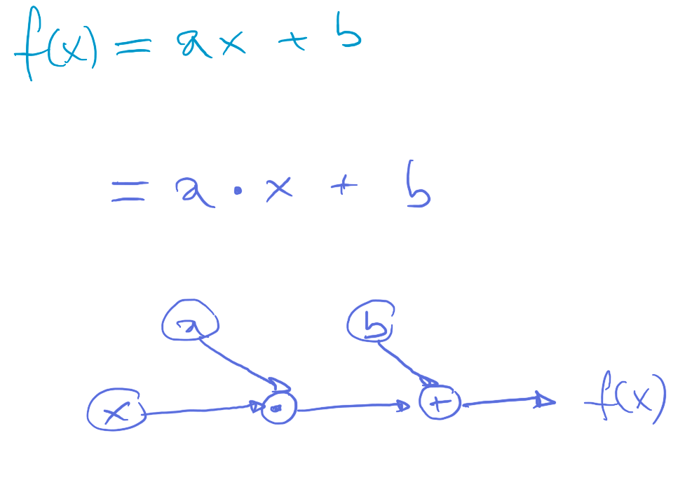
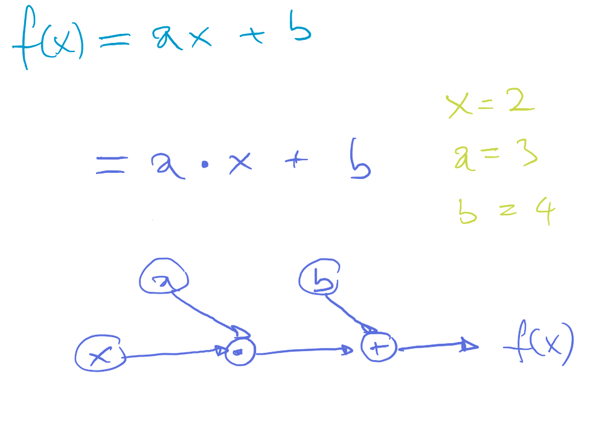
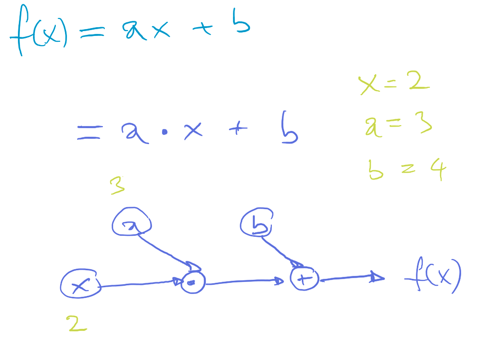
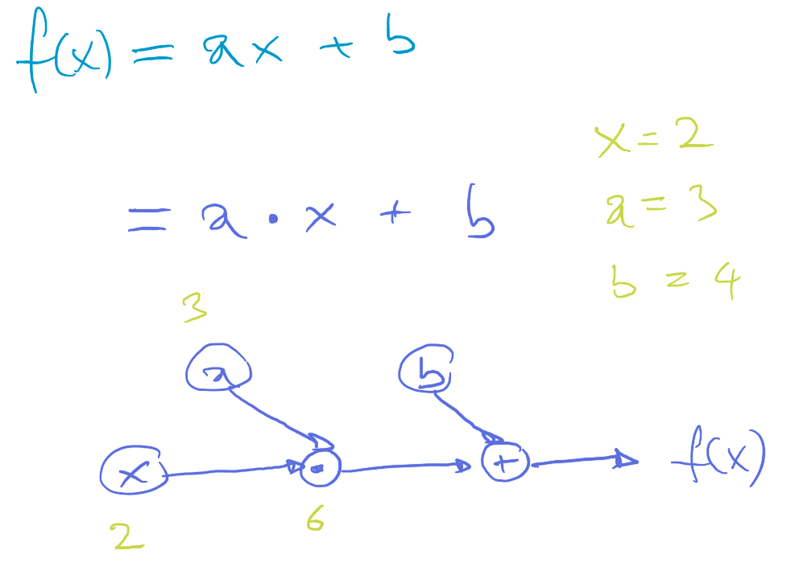
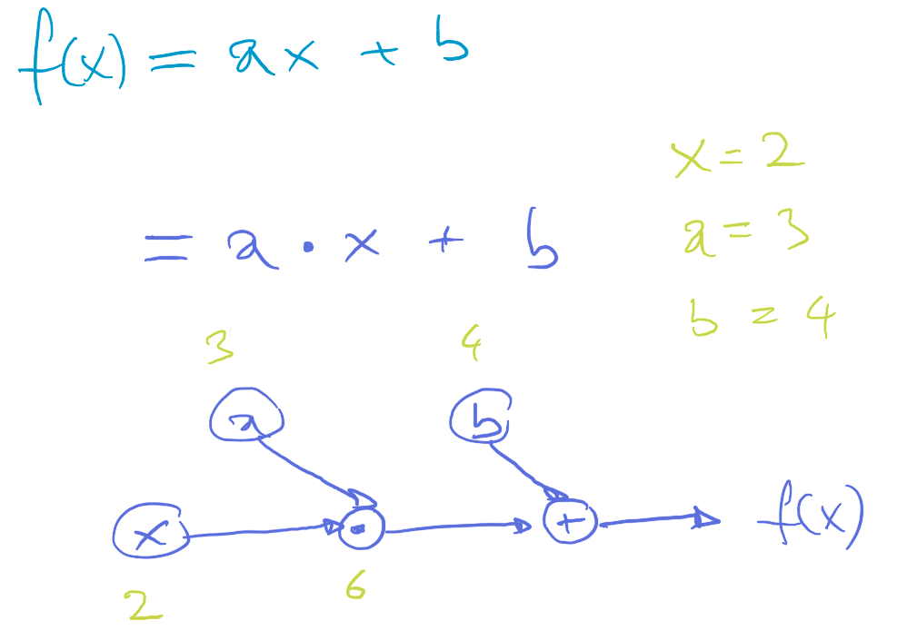
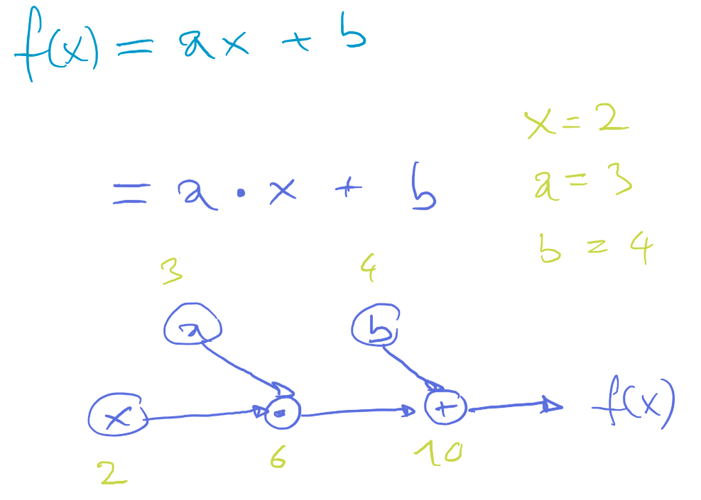

[Home](../../../README.md) / [Sessions](../../README.md) / [Session 4: Machine Learning](../README.md) / [Introduction to Neural Networks](notes_0_introduction_to_neural_networks.md) / Representing Functions as Computational Graphs

# Session 4: Machine Learning

* [Introduction](notes_0_introduction_to_neural_networks.md)
* [Linear Functions](notes_1_linear_functions.md)
* [Modelling Data with Linear Functions](notes_2_modelling_data_with_linear_functions.md)
* Representing Functions as Computational Graphs
* [Training a Computational Graph on Data](notes_4_training_a_computational_graph.md)
* [Computational Graph Exercise](exercise_1_computational_graph.md)
* [Neural Networks](notes_5_neural_networks.md)

## Representing Functions as Computational Graphs

We will now represent a linear function as a computational graph. This will give us a graphical representation of a step by step instruction to compute the function.  

We expand the operands..

...and represent them as nodes in the order of operation: first multiplication and then addition.

We also plug in the variables `a`, `b` and `x` as nodes connected to the respective operands.

Let's calculate with the graph by plugging in some numbers.

Values of 2 for `x` and 3 for `a`...

...gives us 6 at the multiplication node.

We add 4 for `b`...

...and get 10 at the addition node, which delivers the output.

Next: [Training a Computational Graph on Data](notes_4_training_a_computational_graph.md)