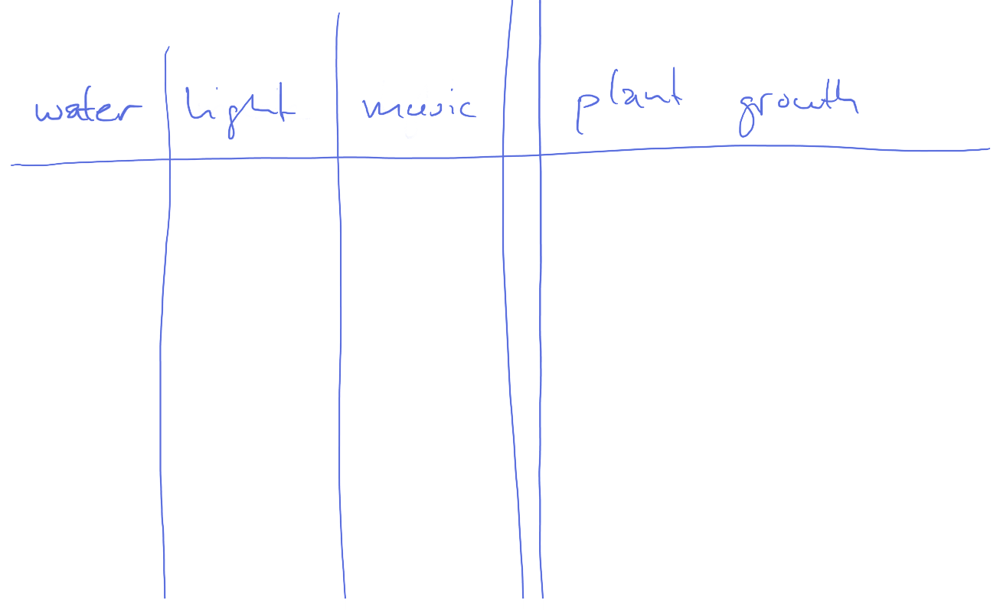
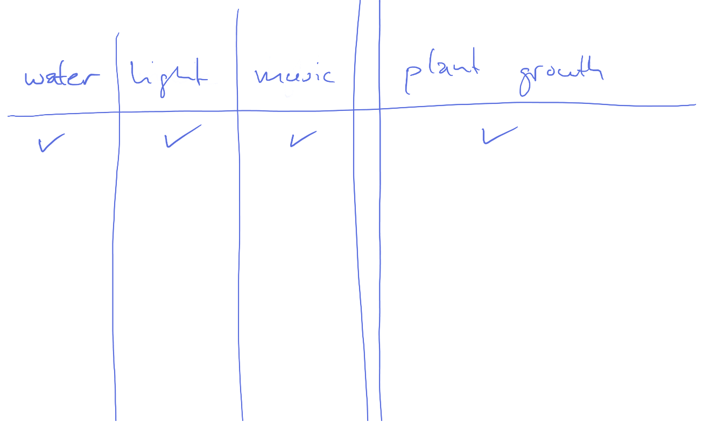
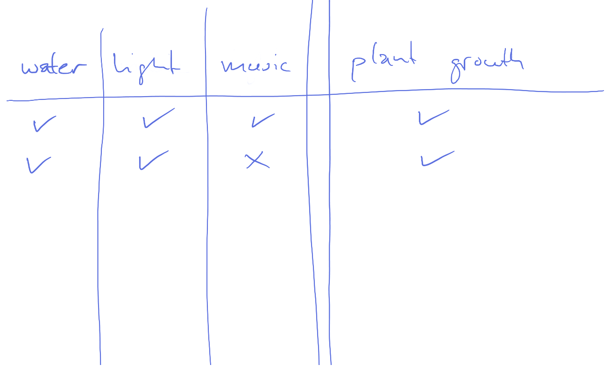
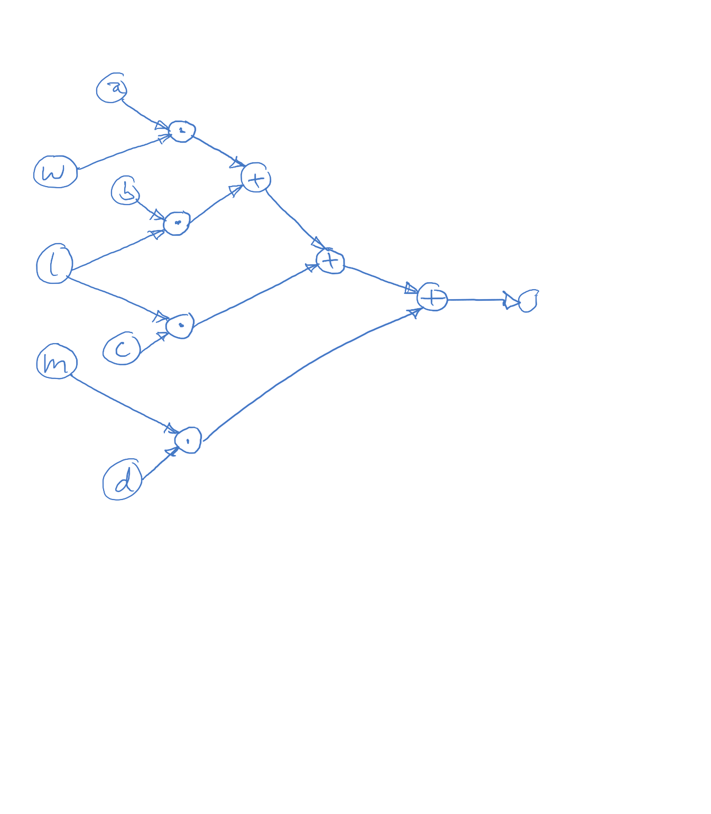
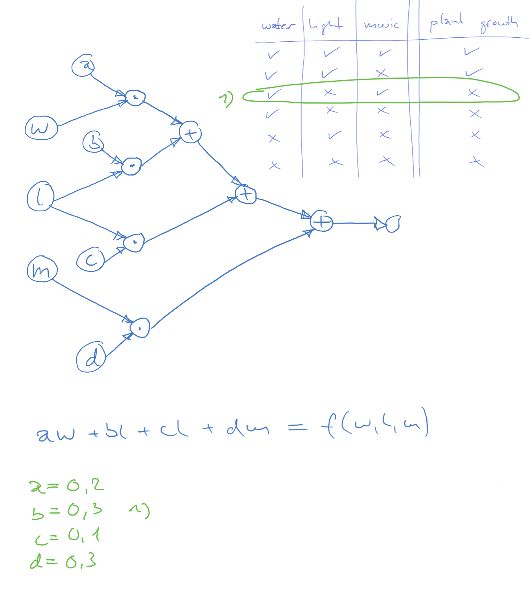
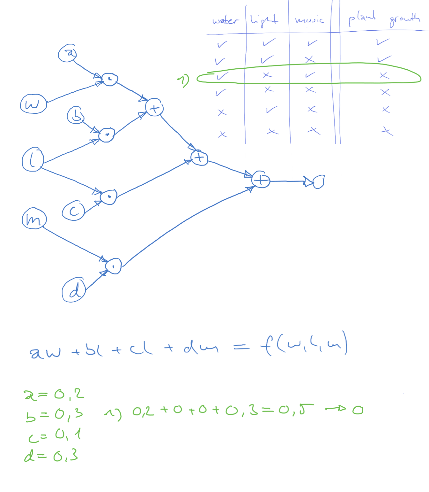
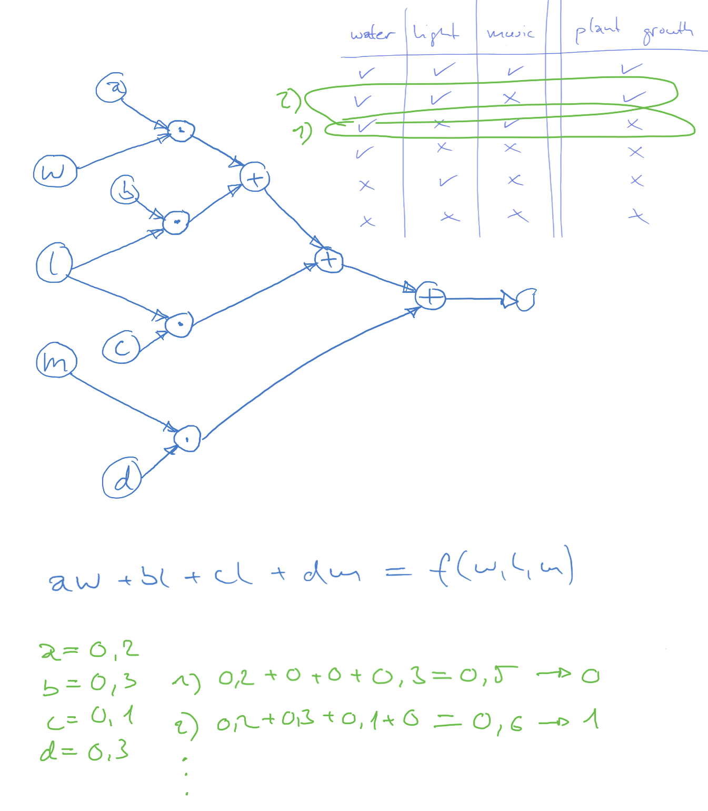

[Home](../../../README.md) / [Sessions](../../README.md) / [Session 4: Machine Learning](../README.md) / [Introduction to Neural Networks](notes_introduction_to_neural_networks.md) / Training a Computational Graph on Data

# Session 4: Machine Learning

* [Introduction](notes_0_introduction_to_neural_networks.md)
* [Linear Functions](notes_1_linear_functions.md)
* [Modelling Data with Linear Functions](notes_2_modelling_data_with_linear_functions.md)
* [Representing Functions as Computational Graphs](notes_3_functions_as_computational_graphs.md)
* Training a Computational Graph on Data
* [Computational Graph Exercise](exercise_1_computational_graph.md)
* [Neural Networks](notes_5_neural_networks.md)

## Training a Computational Graph on Data

Suppose we collected some data. We observed how well our plants grow when we supply them with a combination of water, light and/or music.

We observe, for example, that when supplied with water, light and music our plants grow nicely.

When supplied with water, light, but not music, our plants grow nicely too.

Our plants don't grow when we supply them with water, music, but no lights. We add this and some more observation to our data table.

Let's construct a computational graph that we want to train on this data in order to predict plant growth. We start with our three input nodes water (`w`), light (`l`) and music (`m`).

We construct an arbitrary graph using addition and multiplication nodes. To each multiplication node we add a variable: `a`, `b`, `c` and `d`. We call these variables _weights_ as they control the influence of each node's input on its output.

We can of course represent this graph as a function too: `f(w,l,m) = aw + bl + cl + dm`

_Training_ this graph to predict plant growth means setting the weights in a way that results in the correct output when computed with the respective inputs for `w`, `l` and `m`. To do so, the collected data is typically split into a training set and a test set.

The weights are then _initialised_ with random numbers, typically between 0 and 1.

Each example is fed into the graph. The output of the graph, its _prediction_, is then compared with the desired output, the _ground truth_.

We continue this for all examples in the training set and then update the weights so that the graph's prediction more closely match our ground truth.

Next: [Computational Graph Exercise](exercise_1_computational_graph.md)