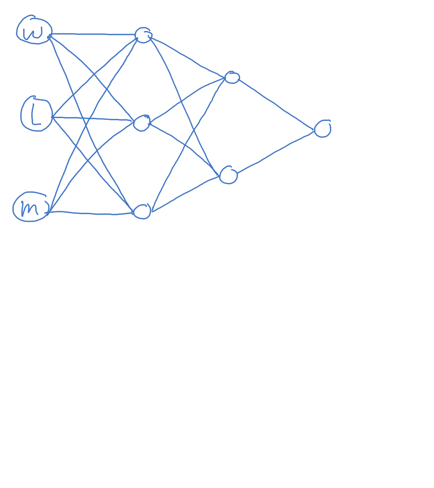
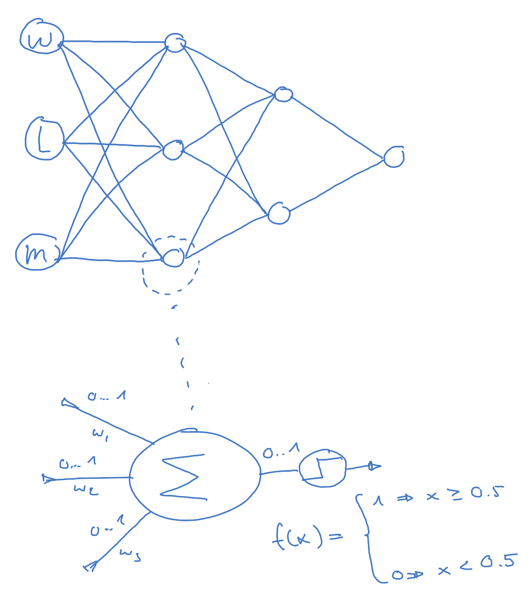
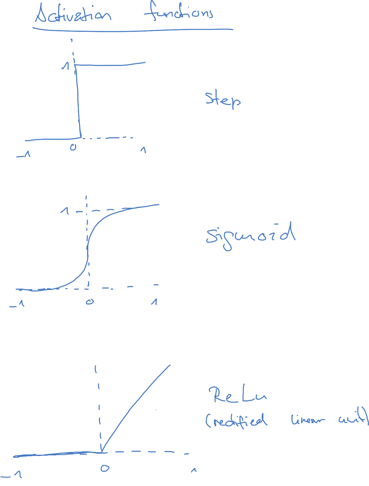

[Home](../../../README.md) / [Sessions](../../README.md) / [Session 4: Machine Learning](../README.md) / [Introduction to Neural Networks](notes_0_introduction_to_neural_networks.md) / Neural Networks

# Session 4: Machine Learning

* [Introduction](notes_0_introduction_to_neural_networks.md)
* [Linear Functions](notes_1_linear_functions.md)
* [Modelling Data with Linear Functions](notes_2_modelling_data_with_linear_functions.md)
* [Representing Functions as Computational Graphs](notes_3_functions_as_computational_graphs.md)
* [Training a Computational Graph on Data](notes_4_training_a_computational_graph.md)
* [Computational Graph Exercise](exercise_1_computational_graph.md)
* Neural Networks

## Neural Networks

A neural network is a computational graph, but not all computational graphs are neural networks.

In contrast to the graph we sketched previously, in a Neural Network all nodes are connected to the nodes in the next layer. Below is a sketch for a possible Neural Networks with our previous three inputs for `w`ater, `l`ight and `m`usic. This is a two-layer network, with three nodes in the first layer and two nodes in the second layer. We don't count the input and output layers.

The nodes are special as well. These are the actual artificial neurons. Each neuron receives the inputs from the previous layers. The input values are multiplied by _weights_, one weight for each input, and then summed up. The result of this summation is passed on to an _activation function_. This function sends either a `0` or a `1` as input to the neuron in the next layer.

A simple activation function is the _step_ function, which sends a `1` when the sum of the weighted inputs is above a certain threshold, e.g. 0.5, and `0` if it is below.

Other activation functions include the _Sigmoid_ and the _ReLU_ function.

The Sigmoid activation function was a crucial component for developing the backpropagation algorithm. This algorithm determines by how much each of the weights in the graph needs to be adjusted in order for the output (prediction) to more closely match the desired output (ground truth). 

With a step activation function it is difficult to say _by how much_ the output of an individual neuron is wrong. With a sigmoid function it is possible to calculate its [derivative](https://en.wikipedia.org/wiki/Derivative) ("steepness") and get an estimate, by how much the output value would need to be changed