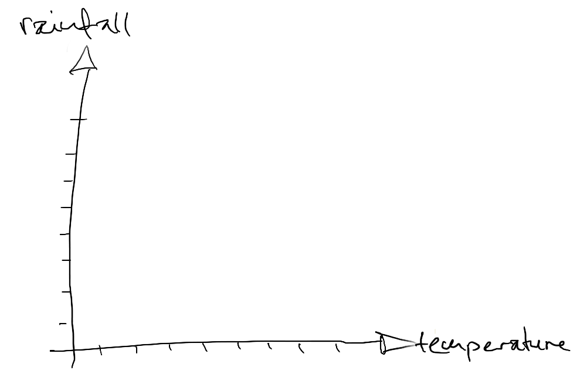
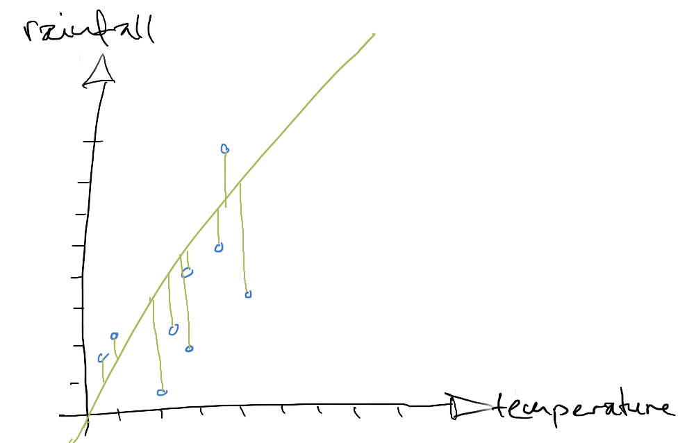
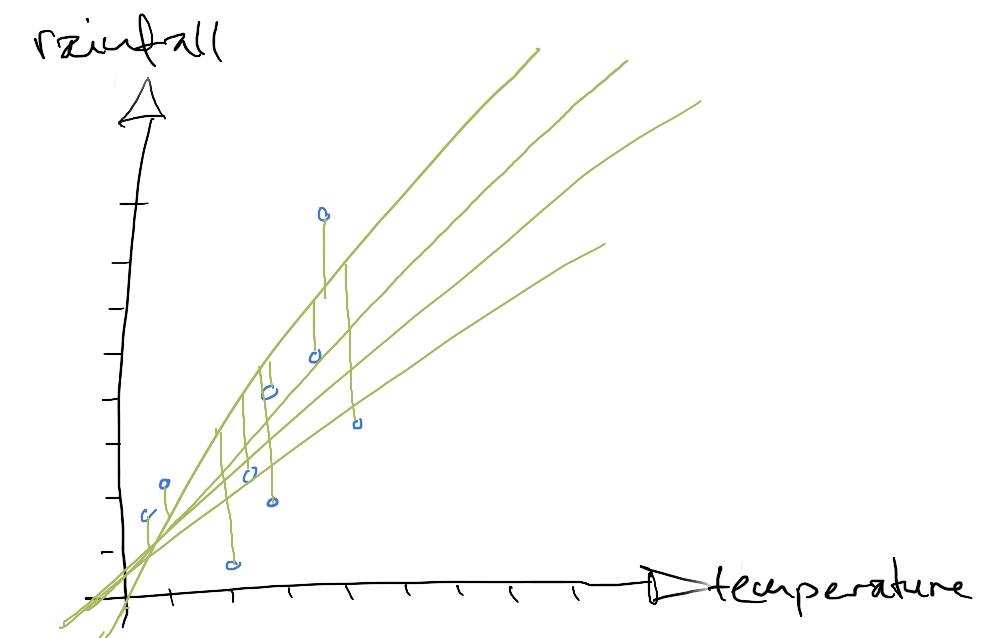
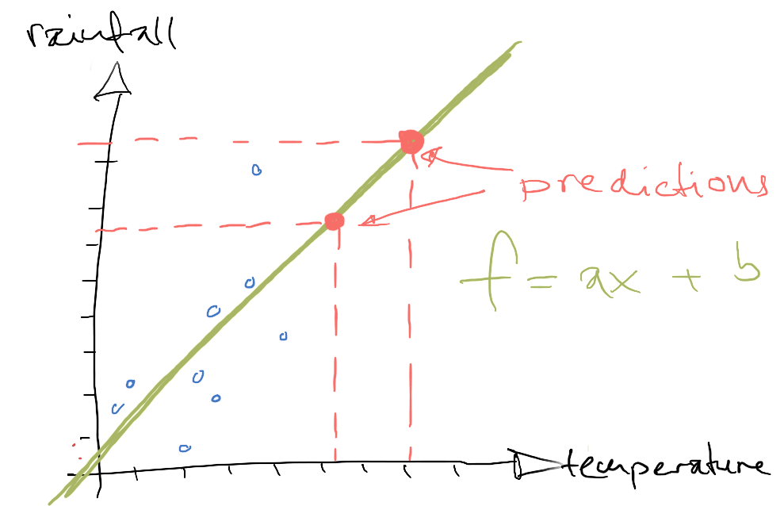

[Home](../../../README.md) / [Sessions](../../README.md) / [Session 4: Machine Learning](../README.md) / Introduction to Neural Networks

# Session 4: Machine Learning

## Introduction to Neural Networks

Through this session I would like students to develop an intuition on how Neural Networks work. 

For a thorough and, at the time of writing, current inroduction to Deep Neural Networks I recommond the lectures on [Convolutional Neural Networks](https://www.youtube.com/watch?v=bNb2fEVKeEo&list=PL3FW7Lu3i5JvHM8ljYj-zLfQRF3EO8sYv) by [Fei-Fei Li](http://vision.stanford.edu/feifeili/), [Justin Johnson](http://cs.stanford.edu/people/jcjohns/) and [Serena Yeung](http://ai.stanford.edu/~syyeung/). 

Rather than employing the metaphor of the brain to explain their functioning I follow the approach also taken in the lectures above of by picturing them as what they are: computational graphs.

In this lecture I use a whiteboard to walk students from linear functions for representing and modelling data, to graph representations of functions and, finally, neural networks as a specific example of a computational graph.

### Linear Functions

A linear function can be plotted as a straight line with respect to a X and Y axis

Linear functions have the form `y = ax + b`. `a` as a multiplier of `x` determines how steep the line is. `b` adds a vertical offset. We use `y` and `f(x)` interchangeably here.

Let's fill in some numbers. For example `2` for `a` and `1` for `b`. We can calculate the values for `f(x)` for arbitrary values of `x`

Plotting examples of `f(x)` as dots...

...and drawing a line through them gives us a plot of the linear function.

### Modelling data as a linear function

Let's plot some 'actual' data. For example, let's assume we have measurements of temperature and rainfall.

Each measurement has two dimensions, amount of rainfall and temperature. We can visualise these measurements in a two-dimensional plot.

Our hypothesis is that the amount of rainfall is dependent on the temperature and that we can model this relationship through a linear function.

We don't know the function, but we can approximate it through [Linear Regression](https://en.wikipedia.org/wiki/Linear_regression). We start with an arbitrary linear function and evaluate how closely this function represents the data by looking at how far each data point is from the line. We take the square of each error. This way we compensate for errors in different directions by making them all positive and we punish data points the further they are away from the line. 

How well our linear function models the represented data is evaluated through the mean square error of all the data points. We adjust the two parameters of the linear function until we reach one where the mean square error is sufficiently low.

This linear function _models_ our data. It does not represent it exactly, but is an approximation, a simplification of our data.

Crucially, we can also use this function to _predict_ new data points. We can get an idea how levels of rainfall might increase with increasing temperatures.

