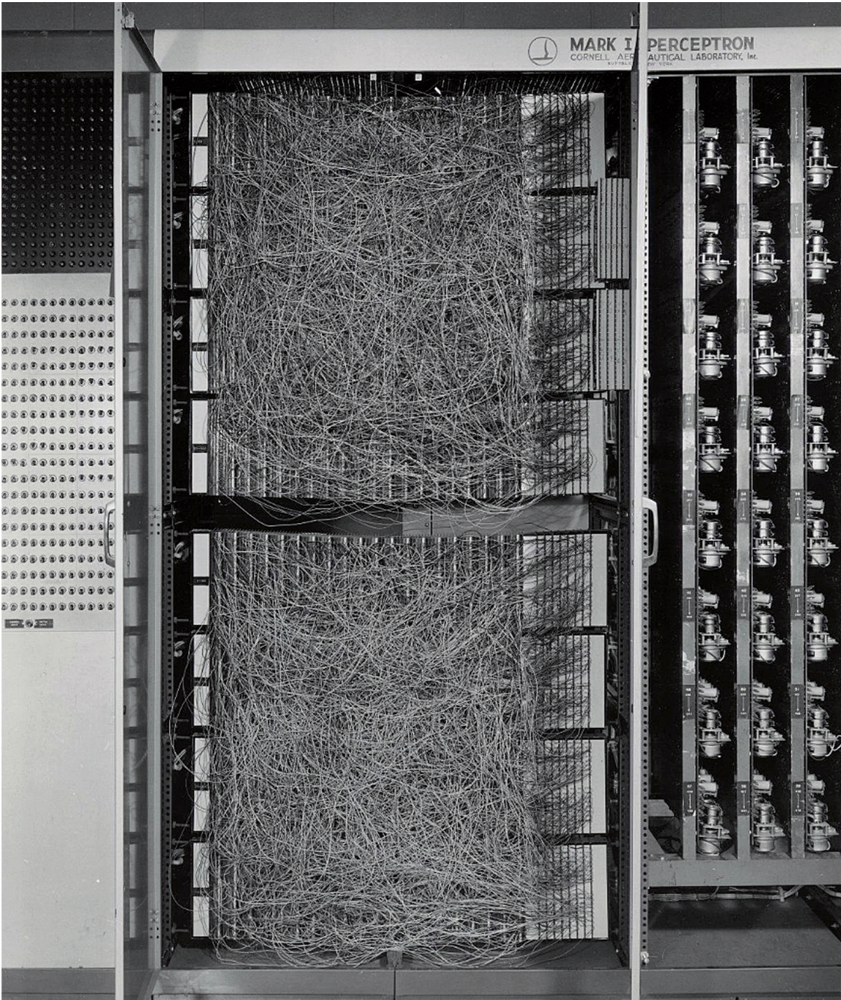
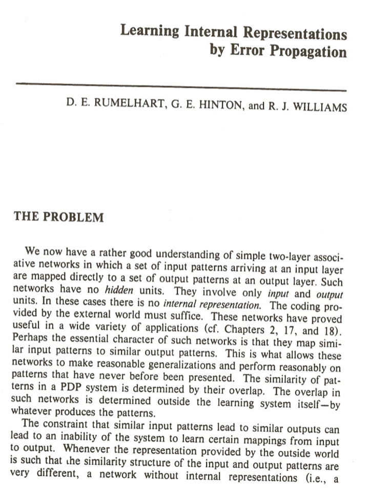

# Session 4: Machine Learning

---

# A Brief History of AI continued
---

## 1958

Rosenblatt's Perceptron

image from http://www.nuriaoliver.com/papers/LIBRO_IA_NuriaOliver_Feb2019.pdf)

---

## 1958

Rosenblatt's Perceptron

image from https://sebastianraschka.com/Articles/2015_singlelayer_neurons.html

---

## 1958-1986

Little research and progress on perceptrons (Neural Networks) due to
- Minsky & Papert's critique
- limited computing power
- no training data
- no of efficient training algorithm

???

- Rosenblatt's Perceptron
- Approach was not widely followed due to Minsky & Papert's damning comment on single layer perceptrons and their inability to solve XOR problems
- Also limited due to
  - little availability of computing power
  - unavailability of training algorithm
  - unavailability of training data
- therefore not much research in Neural Networks until 1980s
- at which point in time also not much progress was made anymore in symbolic AI, or at least the systems developed did not live up to the promises made

---

## 1986

Backpropagation algorithm

image: first page of Rumelhart, D., Hinton, G. & Williams, R. Learning representations by back-propagating errors. _Nature_ 323, 533–536 (1986). https://doi.org/10.1038/323533a0

???

- Rumelhart, Hinton & Williams published work on back propagation algorithm for training neural networks
- built on similar approaches that have already been around earlier
- this, and reaching of dead end in symbolic AI sparked more research in neural networks
---

## 1986

Sigmoid Activation

???

- make the activation function a sigmoid, of which the derivative can be calculateed

---

## 1987-1997

AI Winter

- Enthusiasm ceased, funding was cut
- General purpose computers (Apple, IBM) outperform expensive AI machines

???

- AI Winter
- enthusiasm about AI ceased, funding was cut
- Apple and IBM computers became more powerful than specialised AI machines
- AI research has not reached their self-declared goals (e.g. conversational AI, common sense reasoning)

---

## 1997

IBM Deep Blue

image: IBM Deep Blue at the Computer History Museum, CC-BY [Jim Gardner](https://www.flickr.com/photos/jamesthephotographer/)

???

- Deep Blue, IBM, beat Gary Kasparov in chess
- based on a GOFAI search algorithm, executed on a powerful machine, exhaustive search
- simulating every possible move, and counter-move, identifying the  best one ("brute-force")
- is this AI?
- many successes due to increase in processing power, Moore's law

---

## 1997-2010

AI revived, but still little work on Neural Networks, instead:

- Support Vector machines
- Decision Trees

???

- Again not much work on Neural Networks
- Disappointed by their performance
- instead: Support Vector Machines
  - give a summary of how they work
- Decision Trees 
  - give summary of how they work

---

## 2011

IBM Watson

image: [Ken Jennings](https://en.wikipedia.org/wiki/Ken_Jennings), Watson, and [Brad Rutter](https://en.wikipedia.org/wiki/Brad_Rutter) in their [Jeopardy!](https://en.wikipedia.org/wiki/Jeopardy!) exhibition match. [Fair use](https://en.wikipedia.org/wiki/File:Watson_Jeopardy.jpg).

???
	- IBM Watson won in Jeopardy
	- ? how does Jeopardy work
	- requires common sense, common knowledge
  - available through internet, big data
  
---

## 2015

ImageNet Challenge
- first time AI outperforms human on ImageNet challenge

image from https://houseofbots.com/news-detail/2575-Deep-Learning-vs-Classical-Machine-Learning

???
- what is ImageNet

---

## 2011-now

- Neural Networks feasible through availability of (training) data and processing power
- Deep Learning

???

- progress in AI through availability of (training) data and processing power
- GPU and TPU, parallel processing power
- Deep Learning
    - not entirely new architectures, but only now possible to train (due to processing power and data availability)